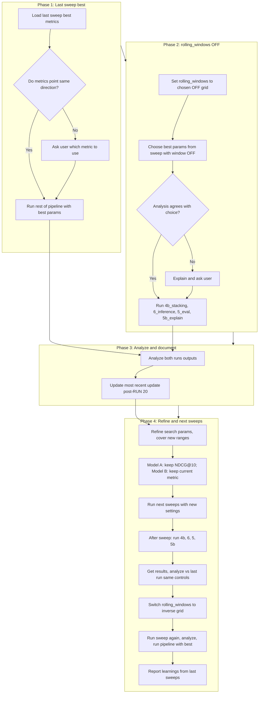

# Sweep-Driven Pipeline Runs and Analysis

## Project path (execution)

**WSL:** `/mnt/c/Users/tmaku/OneDrive/Documents/GSU/Advanced Machine Learning/NBA Playoff Strentgh Project`  
**Windows:** `C:\Users\tmaku\OneDrive\Documents\GSU\Advanced Machine Learning\NBA Playoff Strentgh Project`

All pipeline and sweep execution uses this repo. Sweep outputs live under `outputs3/sweeps/<batch_id>/` (e.g. `phase1_rolling_off`, `phase2_rolling_on`). Run 21 is the first success (Model A contributes; see docs/CHECKPOINT_PROJECT_REPORT.md).

---

## Overview

Plan to run the rest of the pipeline using best params from the last sweep; handle rolling_windows on/off sweeps with conflict checks; analyze both runs; update docs (post-RUN 20); refine search params; then run next sweeps and pipeline with strict execution rules (no background, full runtime, CUDA for speed only, no breaking code changes).

---

## Prerequisites (this project)

This project **satisfies** the prerequisites:

1. **Pipeline scripts:** `scripts/run_full_pipeline.py`, `scripts/run_pipeline_from_model_a.py`, and the numbered scripts (3_train_model_a, 4_train_model_b, 4b_train_stacking, 6_run_inference, 5_evaluate, 5b_explain) are present.
2. **Prior sweep outputs:** `outputs3/sweeps/phase1_rolling_off/` and `outputs3/sweeps/phase2_rolling_on/` contain `sweep_results.csv`, `sweep_results_summary.json` (best_by_spearman, best_by_ndcg, best_by_rank_mae), and per-combo configs.
3. **Config:** `config/defaults.yaml` has `training.rolling_windows`, `sweep.rolling_windows`, and `paths.outputs: "outputs3"`. `scripts/sweep_hparams.py` runs the full pipeline (3 → 4 → 4b → 6 → 5, optionally 4c) with `--config` per combo.

---

## Sweep comparative analysis (integrated)

**Project-specific analysis:** [docs/SWEEP_COMPARATIVE_ANALYSIS.md](docs/SWEEP_COMPARATIVE_ANALYSIS.md) — Phase 1 (rolling off) vs Phase 2 (rolling on); identical test metrics in those runs; Model A was flat (all-zero attention); recommendation to fix/validate Model A then re-run sweeps.

**Methodology for Phases 1–4:**

- **Choosing best combo:** Use `outputs3/sweeps/<batch_id>/sweep_results_summary.json` (best_by_spearman, best_by_ndcg, best_by_rank_mae). If one combo is best on all primary metrics → use it. If different combos are best for different metrics → **stop and ask the user** which metric (or combo) to use.
- **When metrics conflict:** Do not auto-pick. Present options (e.g. primary-metric best, user-specified combo, or run multiple combos and compare run outputs); document the choice.
- **Comparing two runs (e.g. rolling on vs off):** Same controls; compare same metrics across runs; summarize deltas. If conclusions differ → **explain and ask the user** before updating the "most recent update."
- **Reproducibility:** Log run_id/batch_id, config path, rolling_windows, combo id, paths to sweep_results.csv and sweep_results_summary.json.

---

## Pipeline and config (from repo)

- **Full pipeline:** `scripts/run_full_pipeline.py` runs: 1_download_raw → 2_build_db → run_leakage_tests → 3_train_model_a → 4_train_model_b → 4b_train_stacking → 6_run_inference → 5_evaluate → 5b_explain.
- **From Model A (no download):** `scripts/run_pipeline_from_model_a.py` runs: 2_build_db → run_leakage_tests → 3_train_model_a → 4_train_model_b → 4b_train_stacking → 6_run_inference → 5_evaluate → 5b_explain.
- **"Rest of pipeline after training":** the sequence **4b_train_stacking → 6_run_inference → 5_evaluate → 5b_explain**. Defined in both runner scripts. To run after a sweep: run the four scripts in order with the same `--config` (combo config from `outputs3/sweeps/<batch_id>/combo_XXXX/config.yaml`), or re-run from `run_pipeline_from_model_a.py` if the runner supports resume/skip.
- **rolling_windows (YAML only):** `config/defaults.yaml` — `training.rolling_windows: [10, 30]` (default); `sweep.rolling_windows` (grid). `scripts/sweep_hparams.py` reads/writes per-combo config with `cfg["training"]["rolling_windows"]`. `src/training/data_model_a.py` uses `training_cfg.get("rolling_windows", [10, 30])`.
- **Sweep pipeline (scripts/sweep_hparams.py):** 3_train_model_a → 4_train_model_b → 4b_train_stacking → 6_run_inference → 5_evaluate (and optionally 4c_train_classifier_clone). All with `--config <path>`.
- **Metrics:** Model A → NDCG (or current default); Model B → Spearman / rank_mae per sweep_results_summary.json. Spearman tested later.

---

## Workflow (high level)

---

## Phase 1: Run pipeline with last sweep's best

1. **Load last sweep results**  
   From the last sweep batch (e.g. `outputs3/sweeps/phase2_rolling_on` or the most recent batch_id), load `sweep_results.csv` and `sweep_results_summary.json`. Identify the best combo per metric (best_by_spearman, best_by_ndcg, best_by_rank_mae).

2. **Check metric alignment**  
   - If **one combo is best on all metrics** → use that combo.  
   - If **different combos are best for different metrics** → **stop and ask you:** "Metrics point in different directions: [list which metric prefers which combo]. Which metric (or combo) should we use to run the rest of the pipeline?"

3. **Run the rest of the pipeline after training**  
   Set config/params to the chosen best combo (e.g. copy combo config from `outputs3/sweeps/<batch_id>/combo_XXXX/config.yaml` or merge into defaults). Run **4b_train_stacking → 6_run_inference → 5_evaluate → 5b_explain** in order with the same `--config`. **Do not run in background;** allow the program to finish. Save outputs to a known run directory (e.g. `outputs3/run_021_rolling_on` or next run_id).

---

## Phase 2: rolling_windows OFF — best params and pipeline

4. **Set rolling_windows for OFF sweep**  
   Use the sweep that was run with a "window off" grid (e.g. phase1_rolling_off used `[[10, 30]]` only). Update `config/defaults.yaml` / sweep config so `training.rolling_windows` and `sweep.rolling_windows` reflect the OFF grid. No other logic changes.

5. **Choose best params from sweep-with-window-off**  
   Use `outputs3/sweeps/phase1_rolling_off/sweep_results_summary.json` (or the batch with rolling off). Pick the best hyperparameter combo by the same primary metric(s) as agreed for Model A / Model B.

6. **Conflict check**  
   - If **analysis clearly supports one best combo** → proceed.  
   - If **analysis leads to differing conclusions** → **explain the options and ask you** before choosing.

7. **Run rest of pipeline after training**  
   Set params to the chosen best (rolling_windows OFF). Run **4b_train_stacking → 6_run_inference → 5_evaluate → 5b_explain**. Again **foreground only**, full runtime. Save outputs (e.g. `outputs3/run_021_rolling_off`).

---

## Phase 3: Analyze both runs and update docs

8. **Analyze both runs' outputs**  
   Compare: (1) run with best-from-last-sweep (rolling on), (2) run with best-from-sweep-with-window-off. Use same control values where applicable. Summarize metric differences and stability.

9. **Update the most recent update**  
   Update the doc/Notion "most recent update" (the one after RUN 20 where attention was giving usable information) with:  
   - Which params were used for each run (rolling on vs off).  
   - Short summary of the comparison and any conclusion (e.g. "rolling off preferred for X reason").

---

## Phase 4: Refine search and next sweeps

10. **Refine search parameters**  
    - **Model A:** Keep optimization target as NDCG (or current default). Spearman to be tested later.  
    - **Model B:** Continue optimizing for its previously identified metric; plan to experiment with other metrics later unless already in the sweep design.  
    - Adjust search ranges to **cover parameter regions not hit before** (see docs/SWEEP_COMPARATIVE_ANALYSIS.md refined presets).  
    - Apply any project-specific settings for sweeps.

11. **Run next sweeps with new settings**  
    Execute the sweep (with rolling_windows on **or** off as you decide for this round). **Foreground only;** allow sweeps to complete. Ensure CUDA is used (GPU reserved, PyTorch/XGBoost on CUDA) so runs are as fast as possible without code changes.

12. **After sweep completes: run rest of pipeline**  
    - **Get the results** (sweep outputs + any pipeline outputs from this run).  
    - **Analyze results vs last run** using the same control values.  
    - **Switch rolling_windows to its inverse** (if current run was with one grid, next is the other).  
    - **Run sweep again** with the new rolling_windows grid; analyze results; choose best hyperparameters from that sweep.  
    - **Run the rest of the pipeline after training** (4b → 6 → 5 → 5b) with that best combo.  
    - **Analyze these results** (and compare to the previous run with the other window setting).  
    - **Tell you everything learned from the last sweeps** (metrics, stability, rolling on vs off, parameter sensitivity, etc.).

---

## Execution rules (no code or behavior changes)

- **No background execution:** All sweep and pipeline steps run in the foreground.  
- **Allow full runtime:** Do not stop early unless there is an extreme circumstance (e.g. hard failure, safety).  
- **Speed via system setup only:**  
  - Ensure CUDA is used (e.g. `--gpus=all`, env as needed, PyTorch/XGBoost GPU).  
  - Do not change code or break implementation; only ensure system/Docker/config are set so the program runs as quickly as possible.  
- **Robustness:** Keep tests and comparisons as robust as possible (same controls, clear metric definitions, reproducible run IDs and paths).

---

## Run instructions (Phase 1) — from WSL or Windows

**Environment:** In WSL you need a Python env with project deps. If `python3 -m venv .venv` fails, run `sudo apt install python3.12-venv` (or your Python minor version), then `python3 -m venv .venv && . .venv/bin/activate && pip install -r requirements.txt`. Or run from Windows in an environment where `requirements.txt` is already installed.

**Phase 1 — run pipeline with last sweep’s best:**

1. **cd to project**
   - WSL: `cd "/mnt/c/Users/tmaku/OneDrive/Documents/GSU/Advanced Machine Learning/NBA Playoff Strentgh Project"`
   - Windows: `cd "C:\Users\tmaku\OneDrive\Documents\GSU\Advanced Machine Learning\NBA Playoff Strentgh Project"`

2. **Set config to best combo (phase2_rolling_on combo 0).** In `config/defaults.yaml` set:
   - `training.rolling_windows: [5, 10]`
   - `model_a.epochs: 16`  
   (model_b already matches: max_depth 4, learning_rate 0.08, n_estimators 250/200.)

3. **Run pipeline (foreground, allow to finish):**
   - WSL: `PYTHONPATH=. python3 scripts/run_pipeline_from_model_a.py`
   - With venv: `source .venv/bin/activate && PYTHONPATH=. python scripts/run_pipeline_from_model_a.py`
   - Windows: `set PYTHONPATH=. && python scripts\run_pipeline_from_model_a.py`

4. **Outputs:** Next run (e.g. `run_020`) will appear under `outputs3/`. Use that as “run with best params (rolling on)” for Phase 3 comparison.

---

## Phase 2–4 completed (using existing sweep outputs)

**Phase 2:** Best combo from sweep-with-window-off = `outputs3/sweeps/phase1_rolling_off` combo_0000 (rolling_windows [10, 30], epochs 16, model_b same). No conflict. Run with rolling off = phase1_rolling_off/combo_0000/outputs. Sweep preset for rolling off: set `sweep.rolling_windows: [[10, 30]]` only (see config comment and docs/SWEEP_COMPARATIVE_ANALYSIS.md).

**Phase 3:** Comparison documented in [docs/PHASE3_COMPARISON_SUMMARY.md](docs/PHASE3_COMPARISON_SUMMARY.md). Run A (rolling on) = phase2_rolling_on combo_0000; Run B (rolling off) = phase1_rolling_off combo_0000. Metrics identical; no winner. Most recent update added to [docs/CHECKPOINT_PROJECT_REPORT.md](docs/CHECKPOINT_PROJECT_REPORT.md) (section Update post-RUN 20: Hyperparameter Testing).

**Phase 4:** Refined search params applied in `config/defaults.yaml`: model_a_epochs [8, 16, 24, 28], full rolling_windows grid; comment for rolling-off preset ([[10, 30]] only). Model A: keep NDCG; Model B: current metric; expand grid per docs/SWEEP_COMPARATIVE_ANALYSIS.md when tuning.

**Next steps:** When Model A is validated (non-zero attention, decreasing loss), run next sweep (rolling on or off) with the refined presets; run pipeline with best combo; compare. Use CUDA/GPU (Docker WSL or native) for speed. See Run instructions (Phase 1) above for environment setup.
