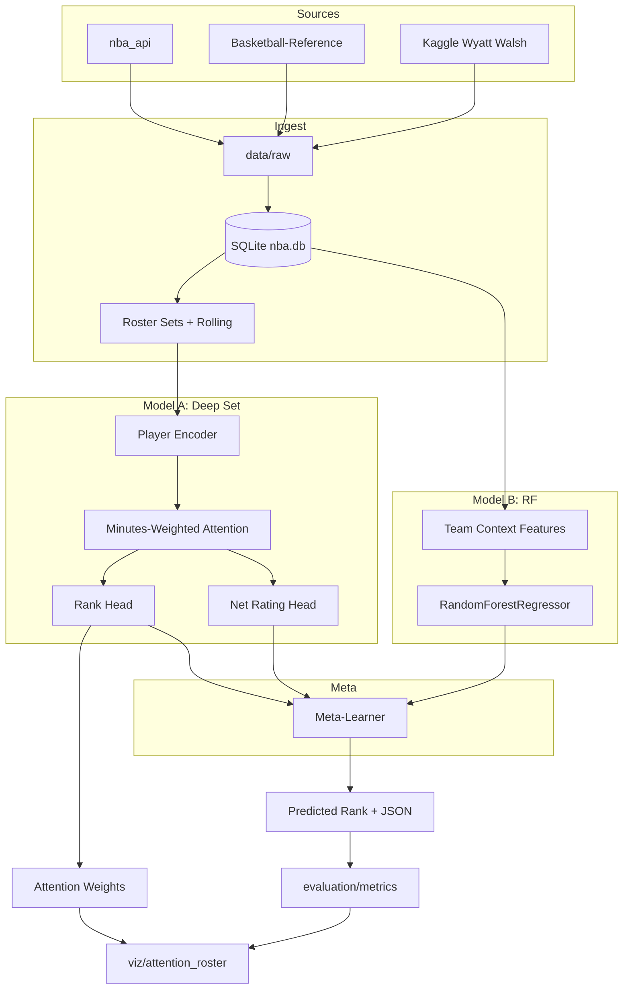

# NBA "True Strength" Prediction — Implementation Plan

## 1. Tech Stack and Environment

| Layer | Choice | Notes |
|-------|--------|-------|
| **DL** | PyTorch | Custom Set + Attention, ListMLE; `torch`, `torch.nn` |
| **DB** | SQLite | Unified DB; `sqlite3` or `sqlalchemy` |
| **Data** | `nba_api`, `basketball-reference-scraper` or `requests`+`BeautifulSoup`, Kaggle API | SOS/SRS from Basketball-Reference; Wyatt Walsh from Kaggle |
| **ML** | `scikit-learn` | `RandomForestRegressor`, `ndcg_score`, `StackingRegressor` or custom meta; `scipy.stats.spearmanr` |
| **Explainability** | `shap` | `DeepExplainer` for Model A; tree explainer for RF |
| **Viz** | `matplotlib`, `seaborn` | Scatter, diverging bar, SHAP summary, stacked area / violin |

Use **Python 3.10+**; pin `shap` to a 3.10-compatible version if needed (e.g. < 0.50 if on 3.10). Create `requirements.txt` and a `pyproject.toml` or `setup.py` if you want an installable package.

---

## 2. Repository Layout

```
mnu/
├── README.md
├── requirements.txt
├── config/
│   └── defaults.yaml          # seasons (2015–16 to 2025–26), paths, model dims, etc.
├── data/
│   ├── raw/                   # downloads, scrapes
│   ├── processed/             # merged CSVs/feather before DB load
│   └── nba.db                 # SQLite (gitignored or in .gitignore)
├── src/
│   ├── data/
│   │   ├── __init__.py
│   │   ├── nba_api_client.py  # nba_api wrappers: games, player/team logs, tracking
│   │   ├── bbref_client.py    # Basketball-Reference SOS, SRS scrape
│   │   ├── kaggle_client.py   # Wyatt Walsh Kaggle dataset fetch
│   │   ├── db_schema.py       # SQLite schema + migrations
│   │   ├── db_loader.py       # load raw/processed into SQLite
│   │   └── build_roster_set.py# roster matrices, rolling stats, embeddings index
│   ├── features/
│   │   ├── __init__.py
│   │   ├── rolling.py         # last 10 / last 30 game windows
│   │   ├── four_factors.py    # eFG%, TOV%, ORB%, FTR (off/def)
│   │   └── team_context.py    # Net Rating, SOS-adjusted, SRS
│   ├── models/
│   │   ├── __init__.py
│   │   ├── player_encoder.py  # Shared MLP: (N_Stats + 32) -> player vector
│   │   ├── set_attention.py   # Multi-Head Attention + minutes-weighted mask
│   │   ├── deep_set_rank.py   # Full Model A: encoder -> attention -> rank + net rating heads
│   │   ├── listmle_loss.py    # ListMLE loss for listwise rank
│   │   ├── rf_ensemble.py     # Model B: RF on team-level features
│   │   └── stacking.py        # Meta-learner: combine A + B (e.g. Linear or small MLP)
│   ├── training/
│   │   ├── __init__.py
│   │   ├── train_model_a.py   # train Deep Set with ListMLE + MSE
│   │   ├── train_model_b.py  # fit RF
│   │   └── train_stacking.py  # fit meta on hold-out or CV
│   ├── evaluation/
│   │   ├── __init__.py
│   │   ├── metrics.py         # NDCG, Spearman, MRR, MAE(Net Rating)
│   │   └── evaluate.py        # run all metrics on (pred_rank, true_rank, pred_nr, true_nr)
│   ├── inference/
│   │   ├── __init__.py
│   │   └── predict.py         # load A+B+stacking, produce JSON output (Sect. 6)
│   └── viz/
│       ├── __init__.py
│       ├── accuracy_plot.py   # Pred vs Actual rank scatter + identity line
│       ├── fraud_sleeper.py   # Diverging bar (Rank Delta)
│       ├── shap_heatmap.py    # SHAP summary (top 20 player encoder features)
│       └── attention_roster.py# stacked area / violin of attention weights
├── scripts/
│   ├── 1_download_raw.py      # nba_api, bbref, kaggle -> data/raw
│   ├── 2_build_db.py          # schema + load
│   ├── 3_build_rosters.py     # rolling, rosters, embed index -> processed
│   ├── 4_train.py             # A -> B -> stacking
│   ├── 5_evaluate.py          # metrics + export for viz
│   └── 6_run_inference.py     # inference + JSON out
├── outputs/                   # predictions, SHAP values, attention weights (gitignored)
└── tests/
    └── (optional unit tests for rolling, four factors, ListMLE, metrics)
```

---

## 3. Data Pipeline

### 3.1 Sources and Rationale

- **nba_api** (primary): `LeagueGameFinder`, `PlayerGameLog`, `TeamGameLog`, `commonteamroster`, and tracking endpoints (speed, distance, touch) for 2015–16 through 2025–26. Use `nba_api.stats.static.players` / `teams` for IDs.
- **Basketball-Reference**: Scrape league/team pages for **SOS** and **SRS** (or use `basketball-reference-scraper` if it exposes these; otherwise `requests` + `BeautifulSoup` with rate limiting ~20 req/min).
- **Kaggle (Wyatt Walsh, `wyattowalsh/basketball`)**: Historical validation and gap-filling; fetch via `kaggle` CLI or `KaggleDataset` and align by `season`, `team_id`, `game_id` where possible.

### 3.2 SQLite Schema (High Level)

- **`games`**: `game_id`, `season`, `date`, `home_team_id`, `away_team_id`, `home_pts`, `away_pts`, `source`.
- **`player_game_logs`**: `game_id`, `player_id`, `team_id`, `min`, `pts`, `reb`, `ast`, `fg3a`, `fg3m`, `fta`, `ftm`, `tov`, `orb`, `drb`, etc., plus any tracking columns you ingest.
- **`team_game_logs`**: team-level box and derived (possessions, pace) for rolling/team features.
- **`rosters`**: `season`, `team_id`, `player_id`, `jersey`, etc.
- **`team_season_context`**: `season`, `team_id`, `sos`, `srs`, `net_rating`, `off_rating`, `def_rating`, `eFG_pct`, `TOV_pct`, `ORB_pct`, `FTR` (and defensive counterparts), `w`, `l`, `standings_rank`, `conference`.
- **`player_embeddings_index`**: `player_id` -> `embedding_id` (int) for the embedding table used in Model A.

Normalize `season` (e.g. `"2015-16"`) and `conference` (`"East"` / `"West"`) everywhere. Standings rank 1–15 per conference from your standings table or BRef.

### 3.3 Roster Set and Rolling Windows

- **Roster matrix**: For each `(season, team_id, conference)` and a chosen "as-of" date (e.g. end of regular season), take up to 15 players by total minutes in that season (or in the last 30 games), ordered by importance. Pad to 15 with zeros and a **mask** (1 = real player, 0 = padding).
- **Rolling stats (per player)**: For each player in that roster, compute over **last 10** and **last 30** games before the as-of date: e.g. `PTS`, `REB`, `AST`, `eFG%`, `TOV%`, `USG%`, `MP` (and any tracking vars you include). These form `N_Stats` (e.g. 7×2 = 14 or more). Missing games (DNP, injury): treat as 0 in that window and use **availability** = 0 for minutes-weighting in attention; otherwise availability = 1.
- **Player embeddings**: Build a vocabulary of all `player_id` in 2015–16 to 2025–26; assign `embedding_id`. In Model A, `nn.Embedding(num_players, 32)`; for unseen/OOV use a dedicated "unknown" index. Input per player: `[N_Stats; embed(embedding_id)]` → length `N_Stats + 32`.

---

## 4. Model A: Set-Based Attention Network

### 4.1 Player Encoder (Shared MLP)

- **Input**: `(B, 15, N_Stats + 32)`, with mask `(B, 15)`.
- **Shared MLP**: 2–3 hidden layers (e.g. 128 → 64) + activation (ReLU) + optional LayerNorm; output `(B, 15, D)` (e.g. `D=64`). Apply mask so padded players do not leak: e.g. zero their activations before attention.

### 4.2 Minutes-Weighted Multi-Head Attention ("The Coach")

- **Multi-Head Attention** over the 15 player vectors (keys/values from encoder output; query can be a learned `[B, D]` or mean of masked encoder outputs).
- **Minutes-weighting**: For each player, `weight = attention_raw * (MP_i / max_MP) * availability_i`. If `availability_i=0` (out/DNP in the relevant window), that player's effective weight is 0. Use `MP` from the last-30 or season average; cap/scale to avoid division issues.
- **Output**: One team vector per team: `(B, D)`.

### 4.3 Heads and Multi-Task Loss

- **Rank head**: Linear `D -> 1` → scalar score per team. For a given conference and season, you have 15 scores. **ListMLE**: true permutation π* from `standings_rank` (1=best); loss: `- sum_i log( exp(s_{π*_i}) / sum_{j>=i} exp(s_{π*_j}) )`. Implement in `listmle_loss.py` with `torch`.
- **Net Rating head**: Linear `D -> 1` → predicted net rating. **MSE** vs `team_season_context.net_rating`.
- **Combined loss**: `L = L_ListMLE + λ * L_MSE` (λ from config, e.g. 0.5–1.0). Both losses computed per conference-season; batch over (conference, season) or (season) with both conferences.

### 4.4 ListMLE Loss (PyTorch)

For sorted indices π* by *ascending* true rank (so π*[0] = actual rank-1 team):

```
L = - sum_{i=0..n-1} log( exp(s[π*[i]]) / sum_{j=i..n-1} exp(s[π*[j]]) )
```

Ensure numerical stability: subtract `max(s[π*[i:]])` inside the log-sum-exp for each `i`.

---

## 5. Model B: Random Forest Ensemble

- **Input**: Team-level features: `net_rating`, `sos`, `srs`, Four Factors (eFG%, TOV%, ORB%, FTR and defensive), `pace`, SOS-adjusted variants. From `team_season_context` / `team_context.py`.
- **Targets**: Rank (1–15) and Net Rating. Fit one RF for rank and one for net rating, or multi-output; for stacking, at minimum a rank-like score.
- **Role**: Robust baseline and "disagree" detector. `sklearn.ensemble.RandomForestRegressor`; tune `max_depth`, `n_estimators`.

---

## 6. Meta-Learner (Stacking)

- **Base predictors**: Model A (rank score, optional net rating); Model B (rank score, optional net rating).
- **Meta inputs**: `[score_A_rank, score_B_rank]` or with net rating. Standardize if needed.
- **Meta model**: (a) Weighted average `w1*score_A + w2*score_B` learned on hold-out; or (b) `StackingRegressor` with `Ridge`/`LinearRegression`, `cv=5`. Output: final rank score → sort 1–15 per conference.
- **Train**: A and B on train seasons (e.g. 2015–16 to 2022–23); meta on hold-out (e.g. 2023–24) or CV. Test on 2024–25, 2025–26.

---

## 7. Evaluation

- **NDCG**: `sklearn.metrics.ndcg_score(y_true, y_score, k=15)`; `y_true` = inverse rank (e.g. 16 - rank).
- **Spearman**: `scipy.stats.spearmanr(pred_rank, actual_rank)` per conference-season; mean over seasons.
- **MRR**: For each (conference, season), position of actual #1 in predicted list (1-based); MRR = mean of `1/position`.
- **MAE (Net Rating)**: `mean(|pred_net_rating - actual_net_rating|)`.

---

## 8. Model Outputs and Inference

Per team: `predicted_rank`, `true_strength_score` (0–1), `predicted_net_rating`, `fraud_sleeper_delta` (= `actual_rank - predicted_rank`), `classification` (Sleeper / Paper Tiger / Aligned), `roster_dependence` from attention (e.g. `star_reliance_score`). Emit JSON per team or `teams[]`. `inference/predict.py` loads A, B, stacking, runs forward pass, extracts attention, writes `outputs/predictions_{season}.json`.

---

## 9. Visualizations

1. **Accuracy plot**: Scatter actual vs predicted rank, identity line, color/size by net rating.
2. **Fraud/Sleeper**: Diverging bar of `actual_rank - predicted_rank`; green > 0, red < 0.
3. **SHAP heatmap**: `DeepExplainer` on player encoder inputs (top 20); `shap.summary_plot`.
4. **Roster attention**: Attention weights α per team; stacked area or violin; heliocentric vs balanced.

---

## 10. Dependencies and Config

- **requirements.txt**: `nba_api`, `pandas`, `numpy`, `requests`, `beautifulsoup4`, `lxml`, `kaggle`, `torch`, `scikit-learn`, `scipy`, `shap`, `matplotlib`, `seaborn`, `pyyaml`, `tqdm`. Optional: `basketball-reference-scraper`, `sqlalchemy`.
- **config/defaults.yaml**: `seasons`, `data.db_path`, `raw_dir`, `processed_dir`, `roster.max_players`: 15, `rolling.windows`: [10, 30], `model_a.embed_dim`: 32, `player_dim`: 64, `n_heads`: 4, `lambda_mse`: 0.5, `model_b.n_estimators`, `max_depth`, `meta.type`, `meta.cv`: 5.

---

## 11. Run Order

1. `1_download_raw.py` → `data/raw`
2. `2_build_db.py` → `data/nba.db`
3. `3_build_rosters.py` → `data/processed/rosters_*.parquet`, `embedding_index.json`
4. `4_train.py` → Model A, B, meta; checkpoints to `outputs/` or `models/`
5. `5_evaluate.py` → `outputs/metrics.json`, CSVs for viz
6. `6_run_inference.py` → `outputs/predictions_{season}.json`

---

## 12. Risks and Mitigations

| Risk | Mitigation |
|------|------------|
| nba_api rate limits | Throttle 1–2 s; rotate User-Agent; cache `data/raw`; Kaggle fallback. |
| BRef structure changes | Isolate in `bbref_client`; tests; Kaggle/manual fallback for SOS/SRS. |
| Roster churn, trades | As-of end of regular season; DNP in logs for availability. |
| ListMLE stability | Log-sum-exp; gradient clipping; smaller LR. |
| SHAP on large Model A | Subset of teams; smaller `nsamples`; encoder inputs, top 20. |
| 2025–26 in progress | Partial season (last-30 with <30 games); optional exclusion from train. |

---

## 13. Out-of-Scope / Later

- Play-by-play and tracking as encoder inputs.
- Injury feeds beyond DNP in last N games.
- Real-time or in-season retraining.
- Cross-conference ranking (focus: 1–15 per conference).

---

## 14. Data and Model Flow



---

## 15. Implementation Todos

| # | Task | Deliverable |
|---|------|-------------|
| 1 | Project scaffold | `requirements.txt`, `config/defaults.yaml`, `src/`, `scripts/`, `data/` |
| 2 | DB + nba_api | `db_schema`, `db_loader`, `nba_api_client` |
| 3 | BRef, Kaggle, rosters | `bbref_client`, `kaggle_client`, `build_roster_set` (rolling 10/30, embedding index) |
| 4 | Model A | `player_encoder`, `set_attention`, `deep_set_rank`, `listmle_loss` |
| 5 | Model B + meta | `four_factors`, `team_context`, `rf_ensemble`, `stacking` |
| 6 | Training | `train_model_a`, `train_model_b`, `train_stacking`; `4_train.py` |
| 7 | Evaluation | `metrics`, `evaluate`; `5_evaluate.py` |
| 8 | Inference | `inference/predict`, JSON (Sect. 6); `6_run_inference.py` |
| 9 | Visualizations | `accuracy_plot`, `fraud_sleeper`, `shap_heatmap`, `attention_roster` |
| 10 | ETL + docs | `1_download_raw`, `2_build_db`, `3_build_rosters`; README run order and env |
