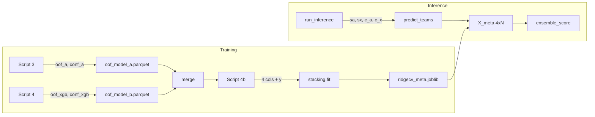

# Confidence-Weighted Ensemble and Project Report

## 1. Confidence definitions (per your semantics)

**Model A (Deep Set)**  

- **Attention entropy** H = -\sum_p w_p \log(w_p) (over player weights, 0·log0 = 0). *High entropy* = diffuse attention → no single player dominates → **high confidence**. *Low entropy* = concentrated on few/one player → star-dependent → **high risk, low confidence**.  
- **Attention max weight:** Higher max ⇒ more decisive focus on one player ⇒ higher injury/volatility risk ⇒ **lower confidence**.  
- **Formula:** e.g. `c_A = w_ent * (H / H_max) + w_max * (1 - max_weight)` so both “more entropy” and “less max” increase confidence. Normalize H by `log(num_players)` for scale. Edge case: 0 players → `c_A = 0.5` (neutral). Configurable weights (defaults: both 0.5).

**XGB**  

- **Tree-level variance:** For each sample, get predictions from each tree (`get_booster()`, `iteration_range=(i, i+1)`), then `std` across trees. Higher variance ⇒ **lower confidence**.  
- **Formula:** `c_X = 1 / (1 + std)` or `exp(-k * std)` so high variance → low c_X. Clip/std-scale so c_X is in a sensible range (e.g. 0–1).

**Optional (later):** OOF-fold variance for Model A would require saving K fold-models and running K inferences per team; not in initial scope. Agreement (A–XGB rank correlation) can be added as an optional 5th meta input if desired.

---

## 2. Data flow (high level)

---

## 3. Implementation plan

### 3.1 Model A confidence helper and script 3 OOF

- **New helper** (e.g. in [src/models/confidence.py](src/models/confidence.py) or inside [src/training/train_model_a.py](src/training/train_model_a.py)): `confidence_from_attention(attn_weights_1d, *, entropy_weight=0.5, max_weight_weight=0.5) -> float`.  
  - Input: 1D array of attention weights (per player), non-negative, can be unnormalized.  
  - Compute: `entropy = -sum(w * log(w))` with 0·log0 = 0; `H_max = log(n)`; `norm_entropy = entropy / H_max` if H_max > 0 else 0; `max_w = max(attn_weights)`.  
  - Return: `entropy_weight * norm_entropy + max_weight_weight * (1 - max_w)`, clipped to [0, 1]. If `n == 0`, return 0.5.
- **[scripts/3_train_model_a.py](scripts/3_train_model_a.py):**  
  - In both OOF paths (walk-forward and K-fold), use `**predict_batches_with_attention**` instead of `predict_batches` for validation.  
  - For each OOF row (team_id, as_of_date, oof_a, y), get the corresponding attention vector (same batch/list index and team index k). Compute `conf_a = confidence_from_attention(attn_weights)`.  
  - Write `**conf_a**` to `oof_model_a.parquet` (new column). Keep existing columns so 4b can still merge on (team_id, as_of_date).

### 3.2 XGB confidence (tree variance) and script 4 OOF

- **New helper** (e.g. [src/models/xgb_model.py](src/models/xgb_model.py) or [src/models/confidence.py](src/models/confidence.py)): `predict_with_uncertainty(model, X) -> (pred, std_or_confidence)`.  
  - Use `model.get_booster()`, then for each tree index `i` get prediction with `iteration_range=(i, i+1)` (raw margin). Stack to (n_trees, n_samples), compute `std` per sample.  
  - Return `(model.predict(X), std)`. Caller then maps std → confidence, e.g. `c_X = 1 / (1 + std)` and optionally clip/normalize across the batch so values are in a reasonable range.
- **[scripts/4_train_models_b_and_c.py](scripts/4_train_models_b_and_c.py):**  
  - In the per-fold OOF loop, after `oof_xgb = xgb_m.predict(X_val)`, compute tree std for `X_val` using the new helper, then `conf_xgb = 1 / (1 + std)` (or configurable formula).  
  - Add `**conf_xgb**` to `val_df` and thus to `oof_model_b.parquet`.  
  - If the helper is not available (e.g. booster iteration fails), fallback: `conf_xgb = 0.5` for that row.

### 3.3 Stacking: 4-column OOF and meta-learner

- **[src/models/stacking.py](src/models/stacking.py):**  
  - `**build_oof**`: Extend to accept optional `conf_a` and `conf_xgb`; if both provided, return `(N, 4)` array `[oof_a, oof_xgb, conf_a, conf_xgb]`; else keep current `(N, 2)` for backward compatibility.  
  - `**fit_ridgecv_on_oof**`: Accept `X_oof` of shape `(N, 2)` or `(N, 4)`; no API change (still `X_oof`, `y`).  
  - `**save_oof` / `load_oof**`: Add optional columns `conf_a`, `conf_xgb`. When saving 4-col, write them; when loading, return 4 arrays if present else 2 (and optionally `conf_a=None`, `conf_xgb=None`). Signature can be `load_oof(path) -> (oof_a, oof_xgb, y, conf_a, conf_xgb)` with last two optional, or keep returning 3 and add `load_oof_full` that returns 5.
- **[src/training/train_stacking.py](src/training/train_stacking.py):**  
  - Accept optional `conf_a`, `conf_xgb`. If both provided, call `build_oof(..., conf_a=..., conf_xgb=...)` and pass 4-col `X_oof` to `fit_ridgecv_on_oof`; save OOF and meta as today. If not provided, current 2-col behavior unchanged.
- **[scripts/4b_train_stacking.py](scripts/4b_train_stacking.py):**  
  - After merge, if both `conf_a` and `conf_xgb` exist in `merged`, pass them to `train_stacking`; else pass only `oof_a`, `oof_xgb`, `y` (so existing OOF files without confidence still train 2-col meta).

### 3.4 Inference: compute confidence and call meta with 4 cols

- **[src/inference/predict.py](src/inference/predict.py):**  
  - `**predict_teams**`: Add optional kwargs `conf_a: np.ndarray | None = None`, `conf_xgb: np.ndarray | None = None`.  
  - When building the ensemble: if `meta_model` is not None and has 4 coefficients (e.g. `len(meta_model.coef_) == 4`), build `X_meta = column_stack([sa, sx, c_a, c_x])` where `c_a`/`c_x` are conf_a/conf_xgb if provided, else fill with 0.5 (so 4-col meta gets neutral confidence). If meta has 2 coefficients, keep current `X_meta = column_stack([sa, sx])` and ignore confidence.  
  - So: backward compatible (old 2-col meta still works); new 4-col meta used when confidence is passed.
- **Inference flow** (same file, `run_inference_from_db`):  
  - When Model A is run, use `**predict_batches_with_attention**`; for each team in `unique_team_ids`, compute `conf_a` from the same attention weights already used for `attention_by_team` (reuse the attn_weights per team). Store in a length-N array `conf_a_arr`.  
  - When XGB is run, for each row get prediction and tree std via the new helper; form `conf_xgb_arr`. If helper fails, use 0.5.  
  - Pass `conf_a=conf_a_arr`, `conf_xgb=conf_xgb_arr` into `predict_teams`.

### 3.5 Config and backward compatibility

- **Config** (e.g. [config/defaults.yaml](config/defaults.yaml)): Add optional section, e.g. `stacking.use_confidence: true`, and `model_a.confidence` (or a shared `confidence` section) with `entropy_weight: 0.5`, `max_weight_weight: 0.5`; XGB confidence formula (e.g. `1 / (1 + std)`). Defaults keep current behavior if `use_confidence` is false or missing (2-col OOF/meta).  
- **Backward compatibility:**  
  - OOF parquets without `conf_a`/`conf_xgb`: 4b builds 2-col meta as today.  
  - Saved meta with 2 coefs: inference uses 2-col input and ignores confidence.  
  - New runs (3 → 4 → 4b with confidence columns): 4-col meta; inference with confidence arrays uses 4-col.

### 3.6 Docs and README

- **[docs/CONFIDENCE_WEIGHTED_ENSEMBLE_OPTIONS.md](docs/CONFIDENCE_WEIGHTED_ENSEMBLE_OPTIONS.md):** Update to state that the **implemented** approach is “Meta-learner with confidence as extra inputs (4 cols)”. Document Model A formula (entropy + max risk) and XGB (tree variance), and that high-risk / low-confidence predictions tend to get downweighted by the learned meta. Keep other options (metric-based switching, Bayesian, agreement) as “future variants” with one-line refs.  
- **README:** Add a short subsection (e.g. under “Key Design Choices”) that the ensemble can use **per-instance confidence**: Model A confidence from attention (entropy and max weight), XGB from tree variance; meta-learner is trained on `(s_A, s_X, c_A, c_X)` when confidence is enabled, so the more confident model has higher effective weight.

### 3.7 Project report

- **New file** (e.g. [docs/PROJECT_REPORT.md](docs/PROJECT_REPORT.md)): A concise **project report** that explains:  
  - **Goal:** NBA “true strength” prediction, sleepers vs paper tigers, no circular evaluation.  
  - **Methodology:** Multi-modal stacking (Deep Set roster model + XGB team-context); ListMLE for ranking; OOF stacking with RidgeCV; evaluation on NDCG, Spearman, playoff outcomes.  
  - **Design choices:** Target (future W/L, playoff seed); no net_rating leakage; 2-model ensemble (A + XGB) with Model C (LR) for diagnostics only; optional confidence-weighted meta (4-input) so the more confident model has higher weight; use of attention entropy/max for A (risk = star-dependence) and tree variance for XGB.  
  - **Confidence semantics:** Why high entropy = high confidence for A; why high max attention = high risk and lower confidence; how this feeds into the 4-input meta and ranking.  
  - **Pipeline:** Scripts 1–2 (data), 3 (Model A + OOF), 4 (B/C + OOF), 4b (stacking), 5 (evaluate), 6 (inference).  
  - No need to duplicate full sweep/eval details; point to existing ANALYSIS.md and sweep docs.

---

## 4. File touch list

| Area                    | Files                                                                                                                                                                            |
| ----------------------- | -------------------------------------------------------------------------------------------------------------------------------------------------------------------------------- |
| Confidence helpers      | New: `src/models/confidence.py` (or extend `train_model_a` + `xgb_model`)                                                                                                        |
| Model A OOF + conf_a    | [scripts/3_train_model_a.py](scripts/3_train_model_a.py)                                                                                                                         |
| XGB uncertainty helper  | [src/models/xgb_model.py](src/models/xgb_model.py) (or confidence.py)                                                                                                            |
| Script 4 OOF + conf_xgb | [scripts/4_train_models_b_and_c.py](scripts/4_train_models_b_and_c.py)                                                                                                           |
| Stacking 4-col          | [src/models/stacking.py](src/models/stacking.py), [src/training/train_stacking.py](src/training/train_stacking.py), [scripts/4b_train_stacking.py](scripts/4b_train_stacking.py) |
| Inference               | [src/inference/predict.py](src/inference/predict.py)                                                                                                                             |
| Config                  | [config/defaults.yaml](config/defaults.yaml)                                                                                                                                     |
| Docs                    | [docs/CONFIDENCE_WEIGHTED_ENSEMBLE_OPTIONS.md](docs/CONFIDENCE_WEIGHTED_ENSEMBLE_OPTIONS.md), [README.md](README.md), new [docs/PROJECT_REPORT.md](docs/PROJECT_REPORT.md)       |

---

## 5. Order of work

1. Add confidence helpers (Model A from attention; XGB tree variance + mapping to c_X).
2. Extend script 3 to emit `conf_a` in OOF (use `predict_batches_with_attention` and new helper).
3. Extend script 4 to emit `conf_xgb` in OOF.
4. Extend stacking (build_oof, save/load, train_stacking, 4b) for optional 4-col.
5. Extend inference (predict_teams + run_inference_from_db) to compute and pass confidence, and use 4-col meta when available.
6. Add config defaults for confidence.
7. Update docs and README; write PROJECT_REPORT.md.

No changes to the plan file itself; this plan is for implementation only.