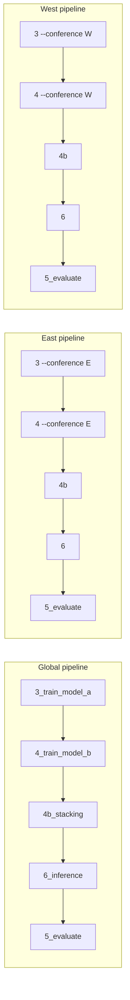

# East/West conference-specific training and comparison

## Goal

Train the full pipeline (Model A, Model B, stacking) on **East-only** and **West-only** data, run inference for each conference, and compare results to the **global** model on the same conference test sets (East model vs global on East teams, West model vs global on West teams).

## Current behavior

- [build_lists](src/training/build_lists.py) already produces per-conference-date lists: each element has `"conference": "E"` or `"W"` and `"team_ids"` / `"win_rates"` for that conference only.
- Train/test split in [compute_split](src/utils/split.py) is date/season-based; it is applied to the full list of (East + West) lists, so train_lists and test_lists both contain E and W lists.
- Models and artifacts live at the **outputs root** (e.g. `outputs3/best_deep_set.pt`, `split_info.json`); [run_inference](src/inference/predict.py) loads from `output_dir` and writes predictions under `output_dir / run_id`.

## Design: separate output directories per conference

Use a **conference-specific output directory** for each run (e.g. `outputs_east`, `outputs_west`) so that:

- Each run has its own `split_info.json`, `best_deep_set.pt`, `xgb_model.joblib`, `rf_model.joblib`, `ridgecv_meta.joblib`, and OOF parquets.
- No change to inference’s model-loading contract (one set of artifacts per output root).
- Comparison is done by loading eval reports from global vs East vs West run dirs and comparing metrics per conference.

Train/test **dates** stay comparable: the same `train_seasons` / `test_seasons` (or `train_frac`) apply; only the **lists** (and thus teams) are filtered by conference, so e.g. test_dates in `split_info` are the same across global and conference runs.

## Implementation plan

### 1. Config and CLI

- **Config**: In [config/defaults.yaml](config/defaults.yaml), add optional `training.conference: null` (or omit). When set to `"E"` or `"W"`, the pipeline runs in conference-only mode.
- **Output path**: When `training.conference` is set, use a dedicated outputs path so artifacts don’t overwrite global. Two options:
  - **A)** Config override: e.g. `paths.outputs: "outputs3_east"` when running East (user or wrapper sets this).
  - **B)** Derive from config: e.g. `paths.outputs_base: "outputs3"` and `outputs = outputs_base + "_" + conference` when conference is set; otherwise `outputs_base`.
- **CLI**: Add `--conference E|W` to scripts 3 and 4 (and optionally 6) so that a single config file can be used and conference is passed on the command line; script sets `config["training"]["conference"]` (and possibly `config["paths"]["outputs"]`) from the flag.

Recommendation: **CLI `--conference E|W**` plus **derived output path** (e.g. `outputs3` -> `outputs3_east` / `outputs3_west`) so one config and three invocations (no flag, `--conference E`, `--conference W`) produce global, East, and West runs without editing YAML.

### 2. Script 3 — Model A ([scripts/3_train_model_a.py](scripts/3_train_model_a.py))

- After `valid_lists = [lst for lst in lists if len(lst["team_ids"]) >= 2]`, if `config["training"].get("conference")` is `"E"` or `"W"`, filter: `valid_lists = [lst for lst in valid_lists if lst.get("conference") == conference]`.
- Compute split and train as today; all downstream steps (OOF, final model) use only that conference’s lists. Walk-forward: same logic, with `step_train_lists` / `step_val_lists` already conference-filtered.
- Write `split_info.json` and artifacts into the **conference output dir** (e.g. `outputs3_east`). Optionally add `"conference": "E"` to `split_info` for inference.
- **Batch cache**: Include `conference` in the fingerprint in [src/training/batch_cache.py](src/training/batch_cache.py) (e.g. in `compute_fingerprint_lists`) so East and West don’t reuse each other’s cached batches.

### 3. Script 4 — Model B ([scripts/4_train_model_b.py](scripts/4_train_model_b.py))

- After `lists = build_lists(...)`, if `training.conference` is set, restrict to that conference: `lists = [lst for lst in lists if lst.get("conference") == conference]`.
- Build `flat` and `df` from these lists only (only East or West (team_id, as_of_date) rows). Restrict to `train_dates_set` from **the same output dir** (conference-specific `split_info.json`), so Model B uses the same split as Model A for that conference.
- Save XGB/RF (and OOF) under the same conference output dir.

### 4. Script 4b — Stacking ([scripts/4b_train_stacking.py](scripts/4b_train_stacking.py))

- No change to logic: it reads `out / "oof_model_a.parquet"` and `out / "oof_model_b.parquet"` and writes `out / "ridgecv_meta.joblib"`. When run with `paths.outputs` pointing to `outputs3_east` (or `outputs3_west`), it uses that run’s OOF and writes meta there.

### 5. Script 6 — Inference ([scripts/6_run_inference.py](scripts/6_run_inference.py) and [src/inference/predict.py](src/inference/predict.py))

- **Model loading**: Already loads from `output_dir` (the outputs root). For a conference run, `output_dir` is e.g. `outputs3_east`, so it loads East-only models; no code change.
- **Target lists**: For a conference run, inference should produce predictions **only for that conference** so that eval has a single-conference set. In `run_inference_from_db`, when building `run_specs` from `lists`, filter `target_lists` to the conference that was trained. Conference can be read from:
  - `split_info.get("conference")` (if script 3 wrote it), or
  - `config.get("training", {}).get("conference")` (if the same config is used for inference).
- So: in `run_inference_from_db`, after loading `split_info`, set `inference_conference = split_info.get("conference") or config.get("training", {}).get("conference")`. When building `run_specs`, for each `(target_date, target_lists, ...)` filter `target_lists` to `[lst for lst in target_lists if lst.get("conference") == inference_conference]` when `inference_conference` is set. That yields predictions only for East (or West) teams when running from a conference output dir.

### 6. Script 5 — Evaluation ([scripts/5_evaluate.py](scripts/5_evaluate.py))

- No change required: when run on a conference output dir and its run_id, it loads `predictions_*.json` from that run (only East or only West teams). Existing `_metrics_by_conference` and `test_metrics_*_by_conference` will have a single key (`"E"` or `"W"`). Global run continues to report both E and W.

### 7. Comparison of results

- **Option A — New script** (e.g. `scripts/compare_conference_models.py`): Takes three run identifiers (global, East, West), e.g. paths or (output_dir, run_id) for each. Loads `eval_report_2023-24.json` and `eval_report_2024-25.json` from each. Builds a comparison table:
  - Rows: metric (e.g. NDCG, Spearman for ensemble, model_a, xgb, rf) and optionally per-season.
  - Columns: Global (East), Global (West), East model (East), West model (West).
  - Or: “East test set: Global vs East model”; “West test set: Global vs West model.”
- **Option B — Document only**: User manually copies metrics from `eval_report_*.json` of the three runs into a table (e.g. in `outputs/ANALYSIS.md` or `docs/CONFERENCE_COMPARISON.md`).

Recommendation: **Option A** (small script or function) that reads the existing eval JSONs and prints or writes a markdown table so the comparison is reproducible.

### 8. Run flow

1. **Global**: `python scripts/3_train_model_a.py` (and 4, 4b, 6, 5) with default config → e.g. `outputs3/`, `run_022/`.
2. **East**: `python scripts/3_train_model_a.py --conference E` (same config; outputs e.g. `outputs3_east/`), then 4, 4b, 6, 5 with `--conference E` (or config set so outputs dir is `outputs3_east` for all).
3. **West**: Same with `--conference W` → `outputs3_west/`.
4. **Compare**: `python scripts/compare_conference_models.py --global outputs3/run_022 --east outputs3_east/run_001 --west outputs3_west/run_001` (or pass output_dirs and use latest run_id per dir).

### 9. Edge cases and notes

- **Reserve run_id**: Script 3’s `_reserve_run_id` writes to `out / ".current_run"`. For conference runs, `out` is the conference output dir, so each conference has its own `.current_run` and run_id sequence (e.g. run_001 in each).
- **Same test dates**: Because split is by season/dates and we only filter lists by conference, train_dates and test_dates in `split_info` are the same for global and conference runs (same config). So comparison is same test dates, different models.
- **Batch cache**: Including `conference` in the batch cache fingerprint avoids cross-conference cache reuse and keeps behavior correct.

## Files to add or touch

| Area        | File                                                         | Change                                                                                           |
| ----------- | ------------------------------------------------------------ | ------------------------------------------------------------------------------------------------ |
| Config      | [config/defaults.yaml](config/defaults.yaml)                 | Add `training.conference: null` (optional).                                                      |
| Batch cache | [src/training/batch_cache.py](src/training/batch_cache.py)   | Include conference in fingerprint when present.                                                  |
| Script 3    | [scripts/3_train_model_a.py](scripts/3_train_model_a.py)     | `--conference`; filter valid_lists; set outputs path; write conference in split_info.            |
| Script 4    | [scripts/4_train_model_b.py](scripts/4_train_model_b.py)     | `--conference`; filter lists; set outputs path.                                                  |
| Script 4b   | [scripts/4b_train_stacking.py](scripts/4b_train_stacking.py) | Pass through config/outputs (no logic change if outputs dir is set by 3/4).                      |
| Script 6    | [scripts/6_run_inference.py](scripts/6_run_inference.py)     | `--conference` and set outputs path so it loads from conference dir.                             |
| Inference   | [src/inference/predict.py](src/inference/predict.py)         | In `run_inference_from_db`, filter target_lists by split_info/conference when conference is set. |
| Compare     | New script e.g. `scripts/compare_conference_models.py`       | Load eval reports from global/East/West run dirs; print or write comparison table.               |
| Docs        | README or docs                                               | Short section on running conference experiments and comparison.                                  |

## Optional: single-output-dir variant

Instead of separate dirs, one could use conference-prefixed artifacts (e.g. `best_deep_set_east.pt`, `xgb_model_east.joblib`) in one output dir and have inference load two model sets and route by conference. That would require more invasive changes (inference loads multiple Model A/XGB/RF/meta, routes by team conference) and a single run would produce both East and West predictions. The “separate output dir per conference” approach keeps the current one-model-set-per-run contract and is simpler to implement and reason about.