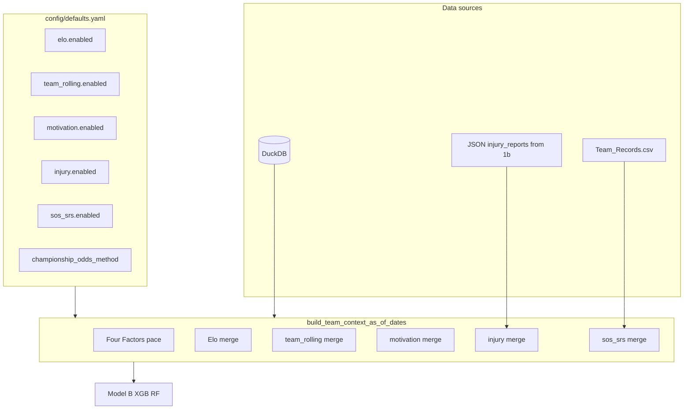

# Enable Optional Features — Implementation Guide

## Summary


| Feature          | Config change                                    | Retrain required | Data/setup                                      |
| ---------------- | ------------------------------------------------ | ---------------- | ----------------------------------------------- |
| Elo              | `elo.enabled: true`                              | Yes (Model B)    | None                                            |
| Team rolling     | `team_rolling.enabled: true`                     | Yes              | None                                            |
| Motivation       | `motivation.enabled: true`                       | Yes              | None (already default)                          |
| Injury           | `injury.enabled: true`                           | Yes              | nbainjuries via 1b (or JSON in injury_reports/) |
| Monte Carlo odds | `output.championship_odds_method: "monte_carlo"` | No               | None                                            |
| SOS/SRS          | `sos_srs.enabled: true`                          | Yes              | data/raw/Team_Records.csv (already present)     |


---

## 1. Elo (ready)

**Config** in [config/defaults.yaml](config/defaults.yaml):

```yaml
elo:
  cold_start_games: 10
  regression_to_mean: 0.25
  enabled: true   # flip from false
```

**Steps:** Edit config, then retrain (4, 4b) and run inference (6).

---

## 2. Team rolling (ready)

**Config** in [config/defaults.yaml](config/defaults.yaml):

```yaml
team_rolling:
  enabled: true   # flip from false
```

**Steps:** Edit config, then retrain (4, 4b) and run inference (6).

---

## 3. Motivation (already on)

`motivation.enabled` is already `true` in config. No action unless it was turned off.

---

## 4. Injury — ProjAvailableRating (nbainjuries)

**Source:** `nbainjuries` package (Option 2). Add to [requirements.txt](requirements.txt). Requires Java 8+ (tabula-py). Data available since 2021-22 only.

**Script 1b rewrite** [scripts/1b_download_injuries.py](scripts/1b_download_injuries.py):

- Call `nbainjuries.injury.get_reportdata(datetime(...), return_df=True)` for each date in config seasons
- nbainjuries returns: `Game Date`, `Team`, `Player Name`, `Current Status`
- Map Team name to team_id via teams table from DB; map Player "Last, First" to player_id via players table (reverse to "First Last")
- Filter status "Out" (and optionally "Questionable")
- Write JSON per date to `data/raw/injury_reports/YYYY-MM-DD.json`: `{ "date": "YYYY-MM-DD", "injuries": [ { "player_id", "team_id", "status" } ] }`
- [src/data/injury_loader.py](src/data/injury_loader.py) already reads that schema; no changes

**Config:**

```yaml
injury:
  data_path: "data/raw/injury_reports"
  source: "nbainjuries"   # or "json" for manual files
  minutes_heuristic: "proportional"
  enabled: true
```

**Steps:** Run `python -m scripts.1b_download_injuries`, enable in config, retrain (4, 4b), run inference (6).

---

## 5. Monte Carlo championship odds (no retrain)

**Config** in [config/defaults.yaml](config/defaults.yaml):

```yaml
output:
  championship_odds_method: "monte_carlo"   # was "softmax"
```

**Steps:** Edit config, run inference (6). No retraining.

---

## 6. SOS/SRS — Team_Records.csv integration

**Data:** [data/raw/Team_Records.csv](data/raw/Team_Records.csv) — from Kaggle [NBA Season Records from Every Year](https://www.kaggle.com/datasets/boonpalipatana/nba-season-records-from-every-year) (boonpalipatana). Columns: `Season`, `Team`, `SRS` (no SOS; use SRS only or duplicate as sos).

**Loader** [src/data/kaggle_loader.py](src/data/kaggle_loader.py):

- Add `load_team_records_srs(path, teams_df)`: read CSV, strip `*` from Team, map Team name to team_id via teams table, return DataFrame `team_id`, `season`, `srs` (sos = srs or null)

**team_context** [src/features/team_context.py](src/features/team_context.py):

- Extend `build_team_context` to accept sos_srs with `team_id`, `season`, `srs` (sos optional)
- In `build_team_context_as_of_dates`: when `config.sos_srs.enabled` and path exists, load via kaggle_loader, pass to `build_team_context(tgl, games, sos_srs=...)`
- Add `sos`, `srs` to `get_team_context_feature_cols` when enabled

**Config:**

```yaml
sos_srs:
  data_path: "data/raw/Team_Records.csv"
  enabled: true
```

**Steps:** Wire loader + team_context, add config, retrain (4, 4b), run inference (6).

---

## Retrain order when enabling Elo, team rolling, injury, or SOS/SRS

1. Script 4 (Model B) — new feature columns
2. Script 4b (stacking)
3. Script 6 (inference)
4. Script 5 (evaluate)

Model A (script 3) does not use these features; no need to retrain it.

---

## Recommended implementation order

1. **SOS/SRS:** Add `load_team_records_srs`, wire in team_context, add config. No new deps.
2. **nbainjuries:** Add to requirements, rewrite 1b script, add config.
3. **Config-only:** Enable Elo, team_rolling (flip to true).
4. **Monte Carlo:** Set `championship_odds_method: "monte_carlo"` (no retrain).
5. **Run 1b** for injury data (requires Java 8+), then enable injury in config.
6. **Retrain** (4, 4b) and run inference (6), evaluate (5).

---

## Optional features architecture




