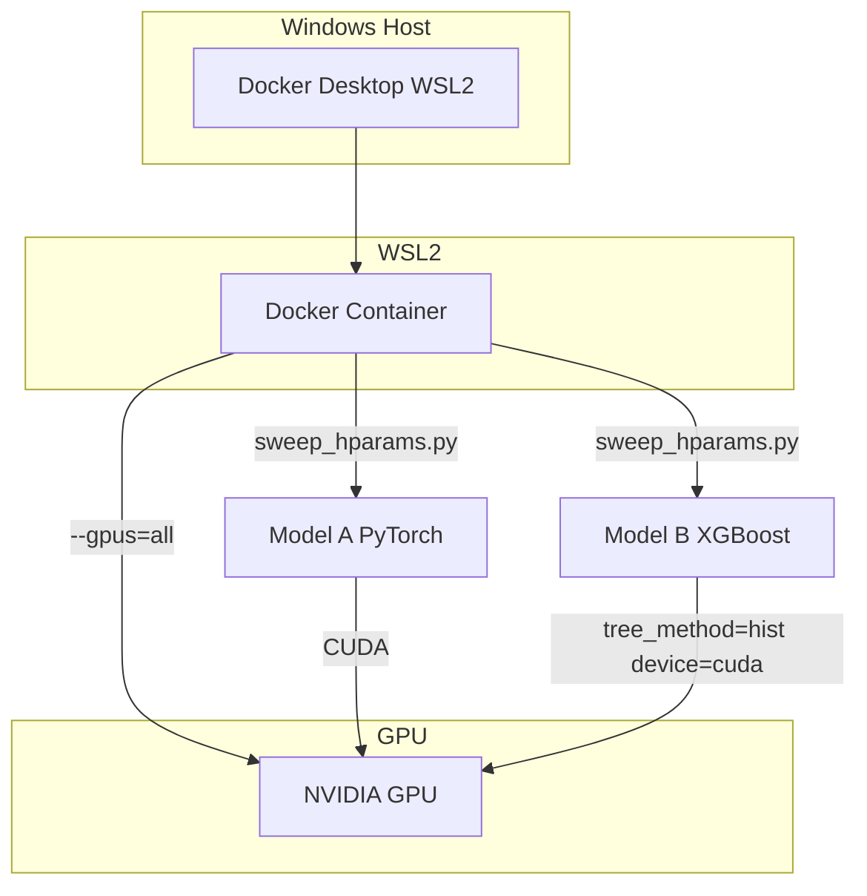

# GPU-Accelerated Sweeps in Docker via WSL2

## Current State

- **Model A (PyTorch)**: Already uses `torch.device("cuda" if torch.cuda.is_available() else "cpu")` in [scripts/3_train_model_a.py](scripts/3_train_model_a.py) and [src/training/train_model_a.py](src/training/train_model_a.py) — no code changes needed for GPU; it will use GPU when available in a CUDA-enabled container.
- **Model B (XGBoost)**: [src/models/xgb_model.py](src/models/xgb_model.py) does NOT set `tree_method` or `device` — runs on CPU only. Must add `tree_method='hist'` and `device='cuda'` when GPU is available.
- **RF (Random Forest)**: scikit-learn — no GPU support; stays on CPU.
- **Sweep**: [scripts/sweep_hparams.py](scripts/sweep_hparams.py) has no per-run timing or structured logging.
- **Docker**: No Dockerfile exists.

---

## Prerequisites (Windows + WSL2)

Per [Docker GPU docs](https://docs.docker.com/desktop/gpu/):

- Windows 10/11, WSL2 backend in Docker Desktop
- [NVIDIA drivers for WSL](https://developer.nvidia.com/cuda/wsl)
- Latest WSL kernel: `wsl --update`
- Validate: `docker run --rm -it --gpus=all nvcr.io/nvidia/k8s/cuda-sample:nbody nbody -gpu -benchmark`

---

## Expected Speedups (from Context7 + web search)

| Component             | Typical speedup                | Notes                                                                 |
| --------------------- | ------------------------------ | --------------------------------------------------------------------- |
| **Model A (PyTorch)** | 2–10x                          | Depends on batch size, model size, GPU. Neural nets scale well.       |
| **XGBoost**           | 1–5x (often ~4x on large data) | Best on larger datasets; small data may see overhead and slower runs. |
| **RF**                | 1x                             | No GPU; unchanged.                                                    |
| **Overall sweep**     | ~2–4x                          | Model A and stacking/inference dominate; XGB helps where it fits.     |

---

## 1. Dockerfile (CUDA + PyTorch + XGBoost)

Create `Dockerfile` at project root:

- Base: `nvidia/cuda:12.1.0-cudnn8-runtime-ubuntu22.04` or `pytorch/pytorch:2.1.0-cuda12.1-cudnn8-runtime` (official PyTorch CUDA image).
- Install Python 3.10+ and project deps from `requirements.txt`.
- Use PyTorch CUDA wheel: `pip install torch --index-url https://download.pytorch.org/whl/cu121`.
- Install `xgboost` (GPU support is built-in when CUDA is available).
- Set `WORKDIR` and `PYTHONPATH`.
- Default `CMD`: run sweep (or override for interactive use).

---

## 2. docker-compose.yml for GPU Sweeps

- Service with `deploy.resources.reservations.devices: ["driver=nvidia,count=all,capabilities=[gpu]"]` (Docker Compose v3).
- Alternatively use `runtime: nvidia` or `--gpus=all` in `docker run`.
- Mount project dir (`.:/app`) so data/outputs persist; ensure `data/` and `outputs*/` are writable.
- Env: `PYTHONPATH=/app`, `CUDA_VISIBLE_DEVICES` optional.

---

## 3. XGBoost GPU Support

In [src/models/xgb_model.py](src/models/xgb_model.py):

- Add optional config keys: `use_gpu: true` (or auto-detect via `torch.cuda.is_available()` or try/except import of `xgboost` with `device='cuda'`).
- When GPU enabled: pass `tree_method='hist'` and `device='cuda'` to `XGBRegressor` (per [XGBoost GPU docs](https://xgboost.readthedocs.io/en/stable/gpu/index.html)).
- In [config/defaults.yaml](config/defaults.yaml): add `model_b.xgb.use_gpu: true` (or `null` for auto).
- Ensure `build_xgb` reads this and sets params accordingly.

---

## 4. Sweep Timing and Logging

In [scripts/sweep_hparams.py](scripts/sweep_hparams.py):

- Import `time` (or `time.perf_counter`).
- For each combo and each script:
  - Record `t_start`, run command, record `t_end`.
  - Store `{script_name: elapsed_sec}` per combo.
- Per combo: log `combo_{i} Model A: 45.2s, Model B: 12.1s, ...` to stdout and to a JSON file (e.g. `sweep_timings.json`).
- Add columns to `sweep_results.csv`: `time_model_a_s`, `time_model_b_s`, `time_total_s`, etc.
- Write `sweep_timings.json` in batch_dir: `{ "batch_id": "...", "combos": [ { "combo": 0, "scripts": {...}, "total_s": 120 } ] }`.
- Optional: append to a single `sweep_run_log.txt` with timestamp and combo id for live monitoring.

---

## 5. Run Script / Cursor CLI

- Add `scripts/run_sweep_docker.sh` (for WSL) or `run_sweep_docker.ps1` (PowerShell) that:
  - Builds: `docker build -t nba-sweep-gpu .`
  - Runs: `docker run --rm -it --gpus=all -v ${PWD}:/app nba-sweep-gpu python -m scripts.sweep_hparams [--batch-id X] [--max-combos N]`
- Document in README; Cursor CLI can invoke these same commands.

---

## 6. Data and Paths

- Ensure `config/paths` uses project-relative paths so they resolve inside the container (e.g. `outputs: outputs3`).
- Mount `.:/app` so `data/`, `outputs3/`, `config/` are available and outputs persist on host.

---

## 7. Notion Update (per user rule)

- Update the relevant Notion page (e.g. [Update8: outputs2, run_019, sweeps](https://www.notion.so/2fa7fab26714810ca20de9af506cbb2b)) with a short section: "GPU sweeps in Docker (WSL2)" linking to this plan and the new run instructions.

---

## Architecture Overview

---

## File Changes Summary

| File                          | Action                                                              |
| ----------------------------- | ------------------------------------------------------------------- |
| `Dockerfile`                  | Create — CUDA base, PyTorch+XGBoost, project deps                   |
| `docker-compose.yml`          | Create — GPU service, volume mounts                                 |
| `scripts/run_sweep_docker.sh` | Create — build + run with `--gpus=all`                              |
| `src/models/xgb_model.py`     | Modify — add `tree_method='hist'`, `device='cuda'` when GPU enabled |
| `config/defaults.yaml`        | Modify — add `model_b.xgb.use_gpu`                                  |
| `scripts/sweep_hparams.py`    | Modify — timing per script, logging to JSON/CSV                     |
| `README.md`                   | Update — GPU sweep instructions                                     |
| Notion (Update8)              | Update — link to GPU sweep workflow                                 |

---

## References

- [Docker Desktop GPU (WSL2)](https://docs.docker.com/desktop/gpu/)
- [PyTorch CUDA containers](https://hub.docker.com/r/pytorch/pytorch)
- [XGBoost GPU](https://xgboost.readthedocs.io/en/stable/gpu/) — `device='cuda'`, `tree_method='hist'`
- Context7: `/pytorch/pytorch`, `/dmlc/xgboost`

