# Model A Attention Fix and Phased Roadmap

## Current state (per conversation summary)

- Project reset to commit **125a765** (run_021 state); branch `feature/post-checkpoint-updates` preserves rank_mae/rank_rmse and sweep work.
- **Problem:** Model A attention is all-zero and train loss is flat in recent sweeps; at report time (run_021) attention was working and Model A contributed.
- **Deliverables:** (1) Fix attention, (2) Debugger for Model A, (3) Confirm reset to run_021 spec, (4) Phased tasks from comparison docs after fix, (5) WSL/GPU note, (6) Side notes so no improvement ideas are lost.
- Notion integration is out of scope.

---

## Phase 0: Model A attention fix (priority)

### Root-cause hypotheses

From [src/models/set_attention.py](src/models/set_attention.py) and [src/training/train_model_a.py](src/training/train_model_a.py):

1. **Mask / minutes:** If `key_padding_mask` is all True for a list, MHA returns zero weights. If `mins_sum` is 0 for all rows, the minutes-bias branch is skipped (`valid.any()` is False), so raw `w` is kept; if raw `w` is zero, gradients never flow through attention.
2. **Encoder collapse:** Encoder output `z` constant or near-zero → attention logits degenerate → softmax flat or zero.
3. **Init / LR:** Aggressive init or LR can collapse attention in the first few steps.
4. **stat_dim:** Code uses `stat_dim_override` from `batches[0]["player_stats"].shape[-1]` in both `train_model_a` and `train_model_a_on_batches`, so config vs data mismatch is unlikely unless batches are built with different feature sets (e.g. optional features toggled).

### Actions (implementation order)

1. **Harden SetAttention** so attention never stays all-zero when gradient should flow:
  - After `out, w = self.attn(...)`, if `w` is all zero (or max below a small threshold) on valid positions, blend with minutes-based weights (or uniform over valid) so that `w` is non-zero and differentiable. Use the same `minutes_bias_weight` / `minutes_sum_min` logic so behavior is consistent.
  - Ensures that even when MHA returns zeros (e.g. all masked or degenerate logits), the rest of the model still receives a non-constant pooled vector and can learn.
2. **Expand attention diagnostics** (use existing `_log_attention_debug_stats`):
  - In [scripts/3_train_model_a.py](scripts/3_train_model_a.py): after building final batches, run attention debug on the first batch before training (so we see init behavior).
  - In [src/training/train_model_a.py](src/training/train_model_a.py): when `NOT_LEARNING_PATIENCE` triggers (train loss not improving), call `_log_attention_debug_stats` before breaking, so we see attention state at collapse.
  - In config, consider a dedicated `attention_debug: true` (or a CLI flag in script 3) to enable debug on first and last epoch without changing default.
3. **Align config with run_021** (best run per [docs/CHECKPOINT_PROJECT_REPORT.md](docs/CHECKPOINT_PROJECT_REPORT.md)):
  - [config/defaults.yaml](config/defaults.yaml): `model_a.stat_dim: 17`, `epochs: 28`, `early_stopping_patience: 0`, `attention_heads: 4`, `minutes_bias_weight: 0.3`, `minutes_sum_min: 1e-6`. Confirm no other model_a or training keys were changed from the state that produced run_021 (e.g. `max_lists_oof`, `max_final_batches`, `listmle_target`, `target_rank`).
  - If you have run_021 checkpoint/config elsewhere, diff against current defaults and document.
4. **Line-by-line review with Context7** (during implementation):
  - Use Context7 to fetch PyTorch docs for `nn.MultiheadAttention` (mask semantics, scaling, dropout) and training best practices (init, gradient flow, learning rate).
  - Review [src/models/set_attention.py](src/models/set_attention.py) and [src/models/deep_set_rank.py](src/models/deep_set_rank.py) and [src/training/train_model_a.py](src/training/train_model_a.py) against those practices (e.g. query construction from masked mean, scaling of scores, gradient clipping already at 1.0).
5. **Optional later:** Learnable query or attention temperature in SetAttention to reduce collapse risk; only if the above does not suffice.

---

## Debugger for Model A

- **New script** (e.g. `scripts/debug_model_a.py`):
  - Load [config/defaults.yaml](config/defaults.yaml) (or `--config`).
  - Build one batch via `build_batches_from_lists` (if DB and lists exist) or `get_dummy_batch` (fallback).
  - Build model with `_build_model(config, device, stat_dim_override=batch["player_stats"].shape[-1])`.
  - Run forward, then backward from a scalar loss (e.g. `score.mean()`), then call `_log_attention_debug_stats` (or equivalent inline: attn sums, attn max, mask/minutes stats, grad norm for `model.attn`).
  - No training loop; purpose is to verify attention is non-zero and gradients flow before a full run.
- **Usage:** Run before `3_train_model_a` when debugging (e.g. `python -m scripts.debug_model_a --config config/defaults.yaml`). Optionally support `--device cpu` / `cuda` and `--batch 0` to pick which batch when using real data.

---

## Reset to run_021 spec (verification)

- Codebase is at 125a765; ensure:
  - **Config:** model_a and training sections match the intended run_021 setup (see Phase 0.3).
  - **Outputs:** `.current_run` in outputs2 can point to the next run (e.g. run_022) for new experiments; run_021 artifacts may not be in repo (outputs2 was listed with only .gitkeep).
- Document in README or ANALYSIS.md: “Best reported run: run_021 (commit 125a765); config in config/defaults.yaml aligned with that run unless otherwise noted.”

---

## Numbered analysis and outputs3 layout

- **Numbered analysis:** Write analysis outputs as numbered files (e.g. `ANALYSIS_01.md`, `ANALYSIS_02.md`, …) in the **same folder as the associated run**.
- **Location:** Use [outputs3/](outputs3/) for all new runs and sweeps:
  - Full pipeline runs: `outputs3/run_001/`, `outputs3/run_002/`, … with `ANALYSIS_01.md`, `ANALYSIS_02.md`, … (and predictions, plots, etc.) inside each run folder.
  - Sweeps: `outputs3/sweeps/<batch_id>/` with numbered analysis (e.g. `ANALYSIS_01.md`) and sweep report in that batch folder.
- **Convention:** Each run or sweep batch gets its own folder under outputs3; analysis files in that folder are numbered sequentially (01, 02, …) so multiple analysis docs per run stay ordered and together.
- **Scripts:** Update evaluation (e.g. script 5) and inference (script 6) so run output and analysis go to outputs3 (e.g. `outputs3/<run_id>/` or `outputs3/sweeps/<batch_id>/`) and write numbered ANALYSIS_XX.md in that folder.

---

## GitHub checkpoints (save between milestones)

- **Checkpoint 1 — After non-zero attention / Model A learning:** Once Phase 0 is done and attention is confirmed non-zero (debug script + one full train), **commit and push to GitHub** before starting Bayesian tuning or later phases.
- **Checkpoint 2 — After Bayesian tuning:** After Optuna/sweep integration is implemented and tested, **commit and push** before Phase 1/2/3 feature work.
- **Ongoing:** Save to GitHub in between major milestones (e.g. after Phase 2, after Phase 3) so progress is preserved and revertible.

---

## Phased tasks (after attention is fixed)

Execute only after Phase 0 is done and attention is confirmed non-zero (e.g. via debug script and one full train).

### Bayesian tuning (immediately after attention fix)

- **As soon as attention is non-zero / Model A is learning:** Implement Bayesian hyperparameter tuning (Optuna) in [scripts/sweep_hparams.py](scripts/sweep_hparams.py) so sweeps run faster and more efficiently than grid search.
- **Then** save to GitHub (Checkpoint 2) before proceeding to Phase 1/2/3.
- **Order:** Phase 0 → Bayesian tuning → GitHub push → Phase 1 → Phase 2 → Phase 3.

### Phase 1 — NBA_ANALYST_METRICS ([.cursor/plans/NBA_ANALYST_METRICS.md](.cursor/plans/NBA_ANALYST_METRICS.md) lines 32–35)

1. Add **TS%** and **usage rate** to rolling player features if beneficial (e.g. in [src/features/rolling.py](src/features/rolling.py) and any columns used by [src/training/data_model_a.py](src/training/data_model_a.py); update stat_dim / PLAYER_STAT_COLS when adding).
2. Implement **BPM-style or Game Score** contribution for playoff players; hook into or extend `compute_playoff_contribution_per_player` in [src/evaluation/playoffs.py](src/evaluation/playoffs.py).
3. Document new metrics in ANALYSIS.md (e.g. outputs2/ANALYSIS.md or project ANALYSIS.md).

### Phase 2 — Enable optional features ([.cursor/plans/enable_optional_features_7b94a57e.plan.md](.cursor/plans/enable_optional_features_7b94a57e.plan.md))

**Data source for Phase II:** Implementation uses JSON and data in [data/](data/): [data/manifest.json](data/manifest.json) for paths and raw hashes; injury data (when enabled) from `data/raw/injury_reports/`; Team_Records or other CSVs in `data/raw` as per enable_optional_features plan.

1. **Elo (mandatory):** Implement or wire [src/features/elo.py](src/features/elo.py); set `elo.enabled: true` in config; retrain Model B (4, 4b) and run inference (6).
2. **Massey (mandatory):** Implement [src/features/massey.py](src/features/massey.py) per comprehensive plan; add to Model B features; retrain (4, 4b) and run inference (6).
3. **SOS/SRS:** Implement `load_team_records_srs` in [src/data/kaggle_loader.py](src/data/kaggle_loader.py), wire in [src/features/team_context.py](src/features/team_context.py), add `sos_srs.enabled` and path in config; use data from [data/](data/) (e.g. `data/raw/Team_Records.csv` if present).
4. **Team rolling:** Enable via config (`team_rolling.enabled`); retrain Model B (4, 4b) and run inference (6).
5. **Injury (nbainjuries):** Rewrite [scripts/1b_download_injuries.py](scripts/1b_download_injuries.py) per plan; read JSON from `data/raw/injury_reports/`; enable `injury.enabled` when data is available.
6. **Monte Carlo odds:** Set `output.championship_odds_method: "monte_carlo"` (no retrain).
7. Motivation is already enabled; keep as is.

### Phase 3 — Comprehensive feature and evaluation ([.cursor/plans/comprehensive_feature_and_evaluation_expansion.plan.md](.cursor/plans/comprehensive_feature_and_evaluation_expansion.plan.md))

- **Foundation:** Pythagorean expectation, SRS (if not done in Phase 2), Four Factors differentials; RAPM-lite in [src/features/on_off.py](src/features/on_off.py).
- **Ratings:** Elo and Massey are mandatory (Phase 2); ensure integrated in Model B and stacking.
- **Calibration — test both Platt scalings:** Implement and **test both** Platt scaling variants: (1) Platt on meta-learner (stacker) output (e.g. RidgeCV scores passed through sigmoid/calibration), and (2) Platt on raw model outputs (e.g. per-model scores calibrated then combined). Compare calibration (e.g. ECE, Brier) and ranking (NDCG, Spearman) in [outputs3/](outputs3/) runs; document in numbered ANALYSIS in the run folder. Code in [src/models/stacking.py](src/models/stacking.py) or a dedicated calibration step.
- **Tuning:** Bayesian optimization (e.g. Optuna) in [scripts/sweep_hparams.py](scripts/sweep_hparams.py); NBA-specific XGBoost ranges per plan.
- **Metrics:** ECE, reliability diagram, Precision@k, Kendall Tau as in plan; document in ANALYSIS.md.
- **Model A / playoff:** Learnable attention temperature, MC Dropout; playoff residual and evaluation (Phases 5–8 in comprehensive plan) as later steps.

---

## WSL / GPU and reproducibility

- **Possible differences:** Running in WSL (Ubuntu) with GPU vs Windows can change results due to CUDA/cuDNN versions, RNG, or numerical precision. To compare:
  - Fix seeds (config `repro.seed`); run same config on both environments.
  - Compare first-epoch train loss and attention debug stats (attn_sum_mean, attn_max_mean, attn_grad_norm) from the new debug script or from script 3 with attention_debug on.
- **Recommendation:** Document environment (OS, Python, PyTorch, CUDA) for the run that reproduces run_021-style attention. Use the debugger and attention_debug output to confirm attention is learning in both environments before trusting sweep results.

---

## Side notes (do not drop)

- **5b_explain:** Use the same config (and stat_dim) as the Model A checkpoint when loading for attention/IG ablation (avoids config/checkpoint mismatch).
- **Per-conference evaluation:** For fair per-conference metrics, use within-conference relevance (e.g. EOS conference rank 1–15) instead of global rank; see checkpoint report Section 3.5.
- **Rank distance metrics:** rank_mae / rank_rmse are on `feature/post-checkpoint-updates`; merge or re-apply after attention fix if desired for evaluation/sweeps.
- **Clone classifier:** Sweep plan includes clone classifier; keep in sweep config when running Phase 2/3 experiments.
- **Run id:** Reserve run_id (script 3) so inference (6) writes to the same run folder; keep `.current_run` in outputs2 for clarity.

---

## Mermaid: high-level flow

```mermaid
flowchart LR
  subgraph phase0 [Phase 0]
    A1[Harden SetAttention]
    A2[Expand attention debug]
    A3[Align config run_021]
    A4[Context7 review]
  end
  subgraph dbg [Debugger]
    D1[debug_model_a.py]
  end
  phase0 --> D1
  D1 --> GH1[GitHub checkpoint 1]
  GH1 --> Bayes[Bayesian tuning Optuna]
  Bayes --> GH2[GitHub checkpoint 2]
  GH2 --> P1[NBA_ANALYST_METRICS]
  P1 --> P2[Phase 2 Elo Massey optional]
  P2 --> P3[Phase 3 Comprehensive]
  P3 --> Platt[Test both Platt scalings]
```

---

## Implementation todos (high level)

| Id                   | Task                                                                                                  |
| -------------------- | ----------------------------------------------------------------------------------------------------- |
| attention-harden     | Harden SetAttention: fallback when raw attention is all-zero so gradient can flow                     |
| attention-debug      | Expand attention diagnostics (script 3 + NOT_LEARNING path + optional config/CLI)                     |
| config-verify        | Verify config/defaults.yaml matches run_021 spec and document                                         |
| context7-review      | Use Context7 to review Model A training and MHA usage line-by-line during implementation              |
| debug-script         | Add scripts/debug_model_a.py for one-batch attention and gradient check                               |
| outputs3-numbered    | Number analysis (ANALYSIS_01.md, …) and write to outputs3/ in same folder as associated run/sweep     |
| github-checkpoint-1  | After non-zero attention / Model A learning: commit and push to GitHub                                |
| bayesian-tuning      | Implement Optuna in sweep_hparams.py; run sweeps; then commit and push (checkpoint 2)                 |
| phase1-metrics       | Phase 1: TS%, usage rate, BPM-style/Game Score playoff contribution; ANALYSIS in outputs3 run         |
| phase2-optional      | Phase 2: Elo (mandatory), Massey (mandatory), SOS/SRS, team_rolling, injury (data/ JSON), Monte Carlo |
| phase2-data          | Phase 2: Use JSON/data in data/ (manifest.json, data/raw/injury_reports/, Team_Records, etc.)         |
| platt-both           | Test both Platt scalings: (1) on meta-learner output, (2) on raw model outputs; document in outputs3  |
| phase3-comprehensive | Phase 3: Pythagorean, SRS, calibration, metrics, playoff residual (per comprehensive plan)            |
| github-checkpoint-2  | After Bayesian tuning: commit and push; save in between Phase 2 and Phase 3 as needed                 |
| wsl-doc              | Document WSL/GPU comparison and reproducibility in README or ANALYSIS in outputs3                     |

