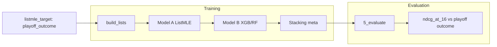

# NDCG@16 with ListMLE playoff_outcome

## Context

- **Baseline**: Phase 3 fine NDCG@16 combo 18 — NDCG@16 **0.550**, Spearman 0.557, playoff_spearman 0.568, using `listmle_target: final_rank` (playoff standings).
- **Goal**: Train ListMLE on `playoff_outcome` (playoff outcome = champion=1, runner-up=2, etc.) and optimize for NDCG@16. Evaluation already uses playoff outcome (EOS_global_rank) when playoff data exists.
- **Hypothesis**: Aligning training target with evaluation metric may improve NDCG@16 on playoff outcome.

## Implementation Steps

### 1. Set default listmle_target to playoff_outcome

In [config/defaults.yaml](config/defaults.yaml), line 77:

```yaml
listmle_target: "playoff_outcome"  # was: "final_rank"
```

### 2. Run NDCG@16 sweep with playoff_outcome

From project root, with `PYTHONPATH` set (per workspace rules), run the sweep in **foreground** with maximum timeout:

```powershell
$env:PYTHONPATH = (Get-Location).Path
python -m scripts.sweep_hparams `
  --config config/outputs4_phase1.yaml `
  --method optuna `
  --n-trials 25 `
  --objective ndcg16 `
  --phase phase2_fine `
  --phase2-best-config outputs4/sweeps/phase3_fine_ndcg16_final_rank `
  --listmle-target playoff_outcome `
  --batch-id phase4_ndcg16_playoff_outcome `
  --no-run-explain
```

- **phase2-best-config**: Centers Optuna search on combo 18 (epochs 22, lr 0.072, XGB 229, RF 173, rolling [15,30]).
- **listmle-target**: Overrides config; trains Model A ListMLE on playoff outcome instead of final standings.
- **--no-run-explain**: Optional; omit to run explain on best combo after sweep.

### 3. Post-sweep

- Compare `outputs4/sweeps/phase4_ndcg16_playoff_outcome/sweep_results_summary.json` best NDCG@16 vs 0.550.
- If improved, consider updating [config/defaults.yaml](config/defaults.yaml) model_a/model_b params to the best combo.
- Update [outputs4/sweeps/OUTPUTS4_ANALYSIS.md](outputs4/sweeps/OUTPUTS4_ANALYSIS.md) with the new sweep row and analysis.

### 4. Notion (if connected)

- Update any sweep tracking database/page with batch `phase4_ndcg16_playoff_outcome`, objective `ndcg16`, `listmle_target: playoff_outcome`.
- Set page icon to robot emoji per project rules.

## Optional follow-ups (if results are weak)

- Increase epochs (24–28), LR (0.08–0.09), or list caps (150/150) via a config override and re-run a smaller sweep.

## Data flow


