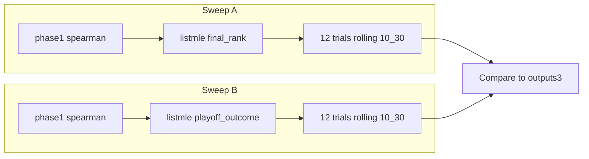

# Phase 1 Spearman Sweeps Rerun Plan

## Context

- **outputs3** (old): phase1_spearman_final_rank and phase1_spearman_playoff_outcome completed successfully; best Spearman 0.499 / playoff_spearman 0.518 (combo 10, [10,30]).
- **outputs4** (ours): same sweeps failed with -inf due to Triton on Windows. phase1_rolling succeeded on WSL.
- **Triton**: `torch.compile` is enabled in [src/training/train_model_a.py](src/training/train_model_a.py). Run in WSL (Triton does not support Windows).

## Goal

Run phase1_spearman_final_rank and phase1_spearman_playoff_outcome on outputs4 using the same phase1 setup (rolling [10,30], epochs 14-26, etc.) to get valid metrics for comparison with outputs3.

---

## Preconditions

- DuckDB with playoff data at `config.paths.db` (or set `NBA_DB_PATH` if using a different DB).
- `outputs4_phase1.yaml` config: paths.outputs=outputs4, run_id_base=25.

---

## Sweeps to Run

Both use `--phase phase1` (rolling [10,30] fixed), `--method optuna`, `--n-trials 12` (to match outputs3), `--objective spearman`.

### 1. phase1_spearman_final_rank

```powershell
$env:PYTHONPATH = (Get-Location).Path
python -m scripts.sweep_hparams `
  --config config/outputs4_phase1.yaml `
  --method optuna `
  --n-trials 12 `
  --n-jobs 3 `
  --objective spearman `
  --phase phase1 `
  --listmle-target final_rank `
  --batch-id phase1_spearman_final_rank_rerun
```

### 2. phase1_spearman_playoff_outcome

```powershell
$env:PYTHONPATH = (Get-Location).Path
python -m scripts.sweep_hparams `
  --config config/outputs4_phase1.yaml `
  --method optuna `
  --n-trials 12 `
  --n-jobs 3 `
  --objective spearman `
  --phase phase1 `
  --listmle-target playoff_outcome `
  --batch-id phase1_spearman_playoff_outcome_rerun
```

**Batch IDs**: Using `_rerun` suffix to avoid overwriting the failed run folders. To overwrite instead, drop the `_rerun` suffix.

---

## Environment


| Option  | Notes                                                 |
| ------- | ----------------------------------------------------- |
| **WSL** | Required. Triton (torch.compile) enabled; Linux only. |


Per [.cursor/rules/run-scripts-foreground-long.mdc](.cursor/rules/run-scripts-foreground-long.mdc): run in foreground with longest timeout; do not use background mode.

---

## Post-Run

1. Compare best Spearman and playoff_spearman to outputs3:
  - outputs3 final_rank: 0.499 / 0.518
  - outputs3 playoff_outcome: 0.482 / 0.487
2. Update [outputs4/sweeps/SWEEP_PHASE1_ANALYSIS.md](outputs4/sweeps/SWEEP_PHASE1_ANALYSIS.md) with rerun results and comparison table.
3. Optionally update [outputs4/sweeps/OUTPUTS4_ANALYSIS.md](outputs4/sweeps/OUTPUTS4_ANALYSIS.md) overview table.

---

## Data Flow




---

## Files


| File                                                                                 | Action                                         |
| ------------------------------------------------------------------------------------ | ---------------------------------------------- |
| [scripts/sweep_hparams.py](scripts/sweep_hparams.py)                                 | No changes needed                              |
| [config/outputs4_phase1.yaml](config/outputs4_phase1.yaml)                           | No changes needed                              |
| [outputs4/sweeps/SWEEP_PHASE1_ANALYSIS.md](outputs4/sweeps/SWEEP_PHASE1_ANALYSIS.md) | Update after rerun with results and comparison |


