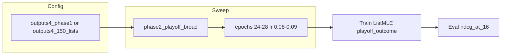

# Playoff Outcome Broad Sweep Plan

## Plan Execution Status (ndcg16_playoff_outcome_sweep)


| Step                                      | Status       | Notes                                                        |
| ----------------------------------------- | ------------ | ------------------------------------------------------------ |
| 1. Set listmle_target to playoff outcome  | Reverted     | Results favored playoff standings; production uses combo 18  |
| 2. Run NDCG@16 sweep with playoff_outcome | Done         | phase4_ndcg16_playoff_outcome, 25 trials, best NDCG@16 0.543 |
| 3. Post-sweep                             | Done         | OUTPUTS4_ANALYSIS updated                                    |
| 4. Notion                                 | Unclear      | Depends on project connection                                |
| **Optional: Broader search**              | **Not done** | epochs 24-28, higher LR, 150/150 list caps                   |


Phase4 sweep underperformed baseline (0.543 vs 0.550). The plan's optional follow-ups were never executed. This plan implements them with increased robustness.

---

## Implementation

### 1. Add phase `phase2_playoff_broad` to sweep_hparams.py

[sweep_hparams.py](scripts/sweep_hparams.py) currently has no phase targeting epochs 24-28 and LR 0.08-0.09. phase2_fine centers on combo 18 (epochs 20-24, lr 0.057-0.087).

Add a new phase after `phase2_fine` (around line 437):

```python
elif phase == "phase2_playoff_broad":
    # Broader search for playoff outcome: epochs 24-28, higher LR, centered on combo 18
    rolling_list = [[15, 30]]
    max_depth_list = [5]
    subsample_list = [0.8]
    colsample_list = [0.7]
    min_leaf_list = [5]
    epochs_list = list(range(24, 29))  # 24-28
    lr_list = [0.08, 0.09]  # higher LR range
    n_xgb_list = list(range(210, 251))  # 210-250, center ~229
    n_rf_list = list(range(160, 191))   # 160-190, center ~173
```

Update `choices` in the `--phase` parser to include `phase2_playoff_broad`.

### 2. Create config for 150/150 list caps

Create [config/outputs4_150_lists.yaml](config/outputs4_150_lists.yaml):

```yaml
# Extends outputs4_phase1; 150/150 list caps for fuller Model A coverage
# Use with: --config config/outputs4_150_lists.yaml

paths:
  outputs: "outputs4"

training:
  max_lists_oof: 150
  max_final_batches: 150
```

Merge with defaults (and optionally outputs4_phase1) when loading. The sweep's `_load_config` deep-merges; pass a config that extends outputs4_phase1. Either:

- `outputs4_150_lists.yaml` extends defaults only and overrides training, or
- Create a single file that includes both outputs4_phase1 content plus 150/150.

Simplest: a standalone override file that sets paths.outputs and training.max_lists_*; `_load_config` merges config/defaults.yaml first, then the override.

### 3. Run sweeps (two variants)

**Sweep A: Broader search space, 100/100 lists (baseline comparison)**  
Uses phase2_playoff_broad to test epochs 24-28 and higher LR.

```bash
python -m scripts.sweep_hparams \
  --config config/outputs4_phase1.yaml \
  --method optuna --n-trials 35 --n-jobs 3 \
  --objective ndcg16 --phase phase2_playoff_broad \
  --listmle-target playoff_outcome \
  --batch-id phase5_ndcg16_playoff_broad \
  --no-run-explain
```

**Sweep B: Same phase with 150/150 lists**  
Checks whether more lists improve playoff_outcome.

```bash
python -m scripts.sweep_hparams \
  --config config/outputs4_150_lists.yaml \
  --method optuna --n-trials 35 --n-jobs 3 \
  --objective ndcg16 --phase phase2_playoff_broad \
  --listmle-target playoff_outcome \
  --batch-id phase5_ndcg16_playoff_150lists \
  --no-run-explain
```

### 4. Post-sweep

- Compare best NDCG@16 from phase5 sweeps vs 0.550 (combo 18).
- Update [outputs4/sweeps/OUTPUTS4_ANALYSIS.md](outputs4/sweeps/OUTPUTS4_ANALYSIS.md) with new sweep rows and brief analysis.
- If a phase5 combo beats 0.550, consider promoting it to production and updating defaults.

### 5. Notion (if connected)

- Add sweep tracking entries for `phase5_ndcg16_playoff_broad` and `phase5_ndcg16_playoff_150lists`.
- Set page icon to robot emoji per project rules.

---

## Sweep Design Rationale

- **Epochs 24-28**: Phase4 best used epochs 20-22; longer training may help playoff_outcome.
- **LR 0.08-0.09**: Phase4 used ~0.057-0.087; higher LR may improve convergence on playoff signal.
- **35 trials**: More than phase4 (25) for better Optuna exploration.
- **150/150 lists**: More lists for Model A; optional separate sweep to test impact.

---

## Data Flow




---

## Files to Touch


| File                                                 | Change                                           |
| ---------------------------------------------------- | ------------------------------------------------ |
| [scripts/sweep_hparams.py](scripts/sweep_hparams.py) | Add phase2_playoff_broad, update --phase choices |
| config/outputs4_150_lists.yaml                       | Create (150/150 lists)                           |
| outputs4/sweeps/OUTPUTS4_ANALYSIS.md                 | Post-sweep update                                |


