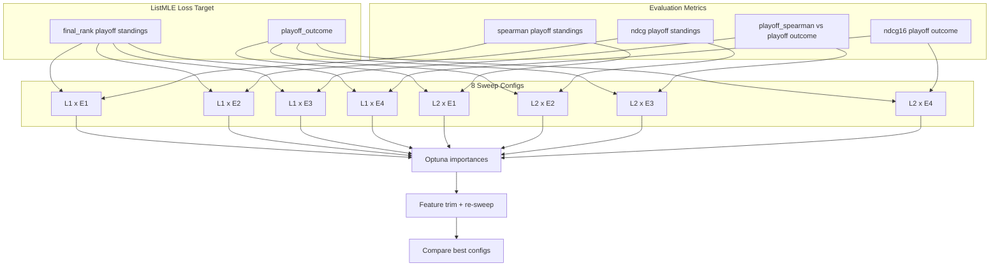

# Push to Main, Update Docs, and Metric-Matrix Exploration Plan

## Part 1: Push to Main

Stage and commit all uncommitted changes (phase2_playoff_broad, outputs4_150_lists.yaml, OUTPUTS4_ANALYSIS updates), then push to `origin/main`.

---

## Part 2: Update Notion

Update these Notion pages (icon: robot emoji per project rules):

- **NBA True Strength — Project (Master)** ([2f87fab2671481d494eacedadbc84039](https://www.notion.so/2f87fab2671481d494eacedadbc84039)): Add Phase 5 sweeps and production config (combo 18) to Recent plans / run summary.
- **Experiments database** (collection://51576f67-5929-45fb-9083-26c5645ef2aa): Add rows for phase5_ndcg16_playoff_broad, phase5_ndcg16_playoff_150lists, phase2_playoff_broad phase.
- **Run Metrics database** (collection://48c85174-a7bf-4aa6-bb81-d815ad43d1f0): Add/update run metrics for combo 18 (NDCG@16 0.550, Spearman 0.557, playoff_spearman 0.568).
- **Changelog**: Add entry for metric-matrix plan, Phase 5 sweeps, and combo 18 as production default.

---

## Part 3: Update Repo Docs

- **[outputs4/sweeps/OUTPUTS4_ANALYSIS.md](outputs4/sweeps/OUTPUTS4_ANALYSIS.md)**: Ensure Phase 5 section and sweep commands are current; add note on metric-matrix exploration.
- **[docs/SWEEP_ANALYSIS.md](docs/SWEEP_ANALYSIS.md)**: Add phase5 sweeps to overview; reference metric-matrix plan.
- **[README.md](README.md)**: Update production default section if needed; link to metric-matrix plan.
- **New:** `docs/METRIC_MATRIX_EXPLORATION_PLAN.md` — full metric-matrix plan (below).

---

## Part 4: Metric-Matrix Exploration Plan

### 4.1 Matrix: Loss Target x Evaluation Metric

| Loss Target (ListMLE)             | Eval Metric                | Sweep Objective    | Notes                                            |
| --------------------------------- | -------------------------- | ------------------ | ------------------------------------------------ |
| final_rank (playoff standings)    | Spearman playoff standings | spearman_standings | Requires eval vs EOS_playoff_standings           |
| final_rank (playoff standings)    | NDCG playoff standings     | ndcg_standings     | Requires eval vs EOS_playoff_standings           |
| final_rank (playoff standings)    | Spearman playoff outcome   | playoff_spearman   | Already supported                                |
| final_rank (playoff standings)    | NDCG playoff outcome       | ndcg16             | Eval uses EOS_global_rank=playoff when available |
| playoff_outcome (playoff outcome) | Spearman playoff standings | spearman_standings | Requires eval vs EOS_playoff_standings           |
| playoff_outcome (playoff outcome) | NDCG playoff standings     | ndcg_standings     | Requires eval vs EOS_playoff_standings           |
| playoff_outcome (playoff outcome) | Spearman playoff outcome   | playoff_spearman   | Already supported                                |
| playoff_outcome (playoff outcome) | NDCG playoff outcome       | ndcg16             | Already supported (phase4)                       |

**Eval extension:** Add explicit `spearman_standings` and `ndcg_at_16_standings` in [scripts/5_evaluate.py](scripts/5_evaluate.py) and [src/evaluation/](src/evaluation/) using `EOS_playoff_standings` as y_true, so standings vs playoff metrics are clearly separated.

### 4.2 Sweep Objectives to Add

In [scripts/sweep_hparams.py](scripts/sweep_hparams.py):

- Add `spearman_standings` and `ndcg_standings` to `_OBJECTIVE_KEYS` (map to new eval keys).
- Ensure `playoff_spearman` and `ndcg16` remain supported.

### 4.3 Promising Hyperparameters (Non-Best) Tracking

Create `outputs4/sweeps/PROMISING_COMBOS.md` to record configs that were strong but not best:

- **Phase 3 fine ndcg16**: Combo 2 (NDCG@16 0.543), Combo 6, etc. — epochs, lr, n_xgb, n_rf.
- **Phase 4 playoff_outcome**: Combo 0 (playoff_spearman 0.525), Combo 7 (Spearman 0.534).
- **Phase 2 coarse**: Combo 7 (rolling best), others with good Spearman.
- **Optuna importances** from each sweep (lr, n_xgb, n_rf, epochs) for feature-trimming context.

### 4.4 8 Sweeps (2 loss targets x 4 objectives)

For each of `final_rank` (playoff standings) and `playoff_outcome` (playoff outcome):

1. **spearman_standings** — optimize Spearman vs playoff standings (EOS_playoff_standings).
2. **ndcg_standings** — optimize NDCG@16 vs playoff standings.
3. **playoff_spearman** — optimize Spearman vs playoff outcome.
4. **ndcg16** — optimize NDCG@16 vs playoff outcome (already done for both targets).

Phase: `phase2_fine` or `phase2_playoff_broad`; 25–35 trials each.

### 4.5 Optuna Importances for Feature Trimming

- After each sweep, read `optuna_importances.json`.
- Aggregate importances across sweeps; identify consistently low-importance params.
- Use Model B SHAP from [scripts/5b_explain.py](scripts/5b_explain.py) to identify low-importance input features.
- Add a feature-trimming experiment: drop lowest-SHAP features, re-sweep, compare.

### 4.6 Final Comparison

- Build a summary table: best combo per (loss_target, objective).
- Compare all 8 configs on a common holdout using: spearman_standings, ndcg_standings, playoff_spearman, ndcg16.
- Select production config as the one that best matches the chosen primary metric (e.g., NDCG playoff outcome or playoff_spearman).

---

## Data Flow

---

## Files to Create/Modify

| File                                                         | Action                                                                |
| ------------------------------------------------------------ | --------------------------------------------------------------------- |
| Git                                                          | Commit, push to main                                                  |
| Notion (Project Master, Experiments, Run Metrics, Changelog) | Update content                                                        |
| outputs4/sweeps/OUTPUTS4_ANALYSIS.md                         | Add metric-matrix ref                                                 |
| docs/SWEEP_ANALYSIS.md                                       | Add phase5, metric-matrix ref                                         |
| docs/METRIC_MATRIX_EXPLORATION_PLAN.md                       | Create (full plan)                                                    |
| outputs4/sweeps/PROMISING_COMBOS.md                          | Create (track promising configs)                                      |
| scripts/5_evaluate.py                                        | Add spearman_standings, ndcg_standings (optional, Phase 2)            |
| scripts/sweep_hparams.py                                     | Add objectives spearman_standings, ndcg_standings (optional, Phase 2) |

---

## Execution Order

1. Push to main.
2. Update Notion pages.
3. Update repo docs (OUTPUTS4_ANALYSIS, SWEEP_ANALYSIS, README).
4. Create docs/METRIC_MATRIX_EXPLORATION_PLAN.md.
5. Create outputs4/sweeps/PROMISING_COMBOS.md from existing sweep results.
6. (Phase 2) Extend eval + sweep for standings metrics; run 8-sweep matrix.

