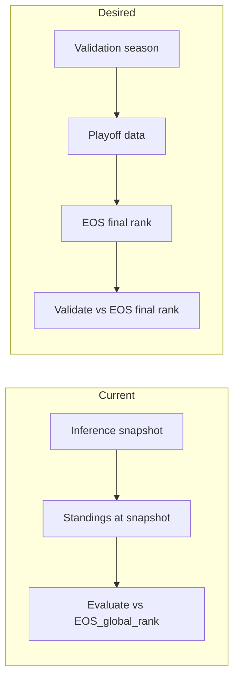

# Validation Season and End-of-Season Final Rank for Validation

## 1. What "validation season" means (and current gap)

**The codebase does not use the term "validation season."** "Validation" in the repo refers to:

- **Early-stopping validation:** Model A uses `early_stopping_val_frac` (e.g. 25% of batches); Model B uses last 20% of dates for early stopping. This is a train-internal holdout, not a season-level concept.
- **Preflight / checklist validation:** [scripts/preflight_check.py](scripts/preflight_check.py) checks DB, config, etc.
- **Walk-forward CV:** Plans mention walk-forward temporal validation; no dedicated "validation season" exists.

**Suggested definition:** A **validation season** is a season for which we have **completed playoff data** and for which we compute an **end-of-season (EOS) final rank** to validate the model. That is the season(s) used to answer: "Did our predicted strength order match how the season actually finished?" So validation is done **against** that EOS final rank. Today we do **not** validate against a playoff-based EOS final rank; we validate against standings-to-date at the inference snapshot.

---

## 2. Current vs desired validation target

| Aspect                                  | Current behavior                                                                                                                                                                                                                                                                             | Your desired behavior                                                                                                                                                                  |
| --------------------------------------- | -------------------------------------------------------------------------------------------------------------------------------------------------------------------------------------------------------------------------------------------------------------------------------------------- | -------------------------------------------------------------------------------------------------------------------------------------------------------------------------------------- |
| **What we call "actual" in evaluation** | **EOS_global_rank** = standings-to-date at the **inference snapshot** (win-rate order from [build_lists](src/training/build_lists.py)). Set in [predict.py](src/inference/predict.py) via `sorted_global = sorted(win_rate_map.items(), ...)` and `actual_global_rank = {tid: i+1 for ...}`. | **End-of-season final rank** computed after the season: champion = 1, first 2 eliminated from playoffs = last (29–30), tie-break: more playoff wins then better regular-season record. |
| **Where it's used**                     | [scripts/5_evaluate.py](scripts/5_evaluate.py) uses **EOS_global_rank** for test_metrics (NDCG, Spearman, MRR, ROC-AUC).                                                                                                                                                                     | Validation (evaluation) should be done **against** this EOS final rank when we have playoff data for that season.                                                                      |
| **Playoff rank today**                  | [compute_playoff_performance_rank](src/evaluation/playoffs.py): 1–16 = playoff teams by **playoff wins** (tie-break reg-season win %), 17–30 = lottery by reg-season win %. Champion is 1, but "first 2 eliminated" are at the bottom of 1–16 (first-round losers), not at 29–30.            | Champion = 1; **first 2 eliminated from playoffs = last** (29–30); tie-break: playoff wins then reg-season record.                                                                     |

So today we validate against **standings order at snapshot**, not against a **playoff-based EOS final rank**. Your definition makes validation align with "how the season actually ended" (champion and first eliminated).

---

## 3. End-of-season final rank (your definition)

- **Rank 1:** Champion (team with most playoff wins; tie-break: reg-season record).
- **Ranks 29–30:** First 2 teams eliminated from the playoffs (e.g. the 2 playoff teams with fewest playoff wins; if tie, worse reg-season record gets 30, then 29).
- **Ranks 2–28:** All other teams ordered by: playoff outcome (more playoff wins = better), then tie-break by regular-season record. Among playoff teams: by playoff wins desc, then reg-season win %. Lottery teams (0 playoff wins) fill the remaining slots (e.g. 17–28) by reg-season win %.

Tie-breaker everywhere: (1) more playoff wins, (2) better regular-season record.

---

## 4. Implementation plan

### 4.1 New EOS final rank in [src/evaluation/playoffs.py](src/evaluation/playoffs.py)

- Add a function, e.g. `compute_eos_final_rank(...)`, that returns `dict[int, int]` (team_id -> rank 1–30) per your rule:
  - Champion = 1 (most playoff wins; tie-break reg-season win %).
  - Identify "first 2 eliminated": the 2 playoff teams with **fewest** playoff wins (tie-break: **worse** reg-season record gets 30, then 29).
  - Assign ranks 2–28 to the remaining 28 teams: the other 14 playoff teams (by playoff wins desc, tie-break reg %), then the 14 lottery teams (by reg %). So ordering: champion (1), then remaining playoff teams (2–15), then lottery (16–28), then first 2 eliminated (29–30).
- Reuse existing helpers: `get_playoff_wins`, `get_reg_season_win_pct`, `_filtered_playoff_tgl`. Require at least 16 playoff teams (same as `MIN_PLAYOFF_TEAMS`).

### 4.2 When to use EOS final rank for validation

- **Validation season** = any season in config for which we have playoff data (e.g. 16+ teams in playoff tables for that season). For that season we can compute `compute_eos_final_rank` and use it as the **ground-truth rank** for validation.
- Options (choose one or both):
  - **Option A (recommended):** When evaluating predictions for a run whose inference snapshot falls in a **completed** season (playoff data exists), compute EOS final rank for that season and add a **validation_metrics** section to the eval report: NDCG/Spearman (and optionally MRR, ROC-AUC upset) using **EOS final rank** as the actual instead of EOS_global_rank (standings). Keep existing test_metrics (standings-based) for backward compatibility.
  - **Option B:** In inference, when playoff data exists for the target season, set **EOS_global_rank** in predictions to this EOS final rank instead of standings order, so existing evaluation (script 5) automatically validates against EOS final rank. This would change the meaning of EOS_global_rank and break comparison with past runs that used standings.

Recommendation: **Option A** — add validation_metrics keyed by EOS final rank so we keep standings-based metrics and add playoff-based validation side by side.

### 4.3 Wiring

- **Inference ([src/inference/predict.py](src/inference/predict.py)):** When playoff data exists for the target season, compute `compute_eos_final_rank` for that season and attach it to predictions (e.g. a new field `eos_final_rank` in each team’s analysis, or reuse/expand `playoff_rank`). Script 5 can then read this and compute validation_metrics when present.
- **Evaluation ([scripts/5_evaluate.py](scripts/5_evaluate.py)):** If predictions include EOS final rank for the evaluation season (e.g. `eos_final_rank` or equivalent for enough teams), compute NDCG/Spearman (and optionally MRR, ROC-AUC upset) using that as the actual and write a **validation_metrics** (or **eos_final_rank_metrics**) section in [eval_report.json](outputs/eval_report.json). Optionally add a short **validation_season** note (e.g. which season the EOS final rank refers to).

### 4.4 Config / docs

- In [config/defaults.yaml](config/defaults.yaml) or [README.md](README.md), add a short note: **validation season** = a season for which we have completed playoff data and compute end-of-season final rank (champion = 1, first 2 eliminated = last, tie-break: playoff wins then reg-season record) for validation.
- No need for a new config key unless you want to restrict validation to specific seasons (e.g. `validation_seasons: ["2022-23", "2023-24"]`); otherwise "any season with playoff data" is enough.

---

## 5. Data flow (high level)

---

## 6. Edge cases

- **Play-in losers:** Your "first 2 eliminated from the playoffs" likely means from the **main** playoff bracket. Play-in losers are not in the playoff_* tables (Play-In excluded). So they are lottery teams (0 playoff wins) and get ranks in the 17–28 range by reg-season record; they are not forced to 29–30 unless you explicitly add a rule for them.
- **Fewer than 16 playoff teams:** Keep existing behavior: do not compute playoff-based rank if `len(playoff_team_ids) < 16`; no validation_metrics for that season.
- **Ties for "first 2 eliminated":** Among playoff teams with fewest wins, order by reg-season win % (worse = more eliminated); assign 30 to worst, 29 to second worst.

---

## 7. Summary

| Item                  | Action                                                                                                                                                          |
| --------------------- | --------------------------------------------------------------------------------------------------------------------------------------------------------------- |
| **Validation season** | Define in docs as: season with completed playoff data used to compute EOS final rank for validation.                                                            |
| **EOS final rank**    | Implement in [src/evaluation/playoffs.py](src/evaluation/playoffs.py): champion = 1, first 2 eliminated = 29–30, tie-break playoff wins then reg-season record. |
| **Validation target** | Validate (evaluate) against this EOS final rank when available; add validation_metrics (or eos_final_rank_metrics) in eval report (Option A).                   |
| **Inference**         | Optionally attach EOS final rank to predictions when playoff data exists for target season.                                                                     |
| **Evaluation**        | When EOS final rank is present in predictions, compute and report validation_metrics.                                                                           |

