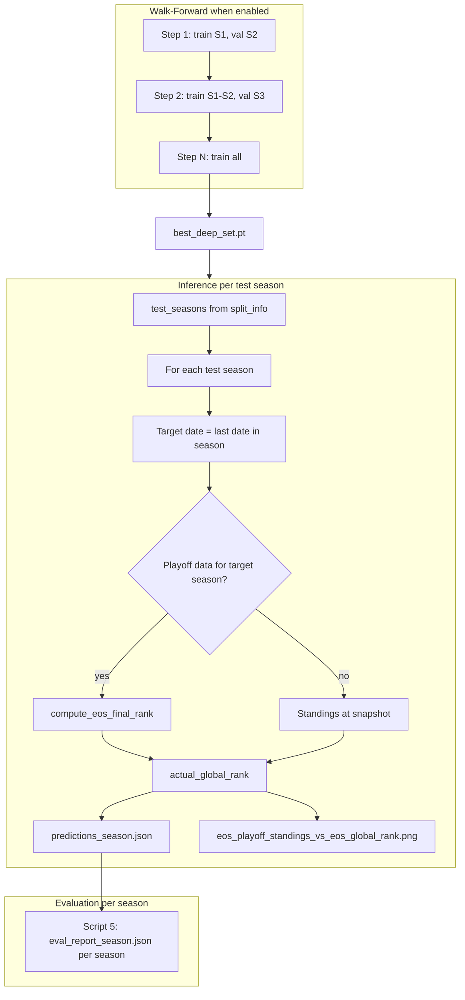

# Combined: Per-Season Walk-Forward Training + EOS Final Rank (Option B)

This plan merges three features:

1. **Per-season walk-forward training** for Model A (expand training set season by season, validate on next unseen season)
2. **EOS final rank for validation** via **Option B**: when playoff data exists for the target season, set `EOS_global_rank` in predictions to the EOS final rank instead of standings order. Script 5 unchanged; it reads `EOS_global_rank` and evaluates against it.
3. **EOS_playoff_standings (End of Regular Season = playoff standings)** in outputs: add `analysis.EOS_playoff_standings` to each team — the final regular-season standings rank (1–30 by win %), which determines playoff seeding.

---

## Part A: Per-Season Walk-Forward Training

### A.1 Season utilities in split module

**File:** [src/utils/split.py](src/utils/split.py)

- Export `date_to_season(as_of_date, seasons_cfg) -> str | None` (promote `_date_to_season` or add public wrapper)
- Add `get_train_seasons_ordered(config) -> list[str]`: return `train_seasons` from config, sorted by season start date. Ensures chronological order for walk-forward
- Add `group_lists_by_season(lists, seasons_cfg) -> dict[str, list]`: map season key -> list of lists. Uses `date_to_season` per list

### A.2 Config option

**File:** [config/defaults.yaml](config/defaults.yaml)

Add under `training:`:

```yaml
walk_forward: false   # if true, use per-season walk-forward instead of pooled OOF
```

### A.3 Script 3 walk-forward mode

**File:** [scripts/3_train_model_a.py](scripts/3_train_model_a.py)

When `walk_forward: true`:

1. Compute split and write `split_info.json` (unchanged)
2. Get `train_seasons_ordered` (e.g. `["2015-16", ..., "2022-23"]`)
3. Group `train_lists` by season via `group_lists_by_season`
4. For each step k in 1..N:
  - Train on seasons 1..k, validate on season k+1 (if k < N)
  - Build batches, train via `train_model_a_on_batches`, collect OOF rows `(team_id, as_of_date, oof_a, y)` for validation season
  - Print step summary
5. Last step (k == N): train on all, no next season, save `best_deep_set.pt`
6. Write `oof_model_a.parquet` from accumulated OOF rows

When `walk_forward: false`: keep current pooled OOF + final model behavior.

---

## Part B: EOS Final Rank (Option B)

### B.1 New EOS final rank in playoffs.py

**File:** [src/evaluation/playoffs.py](src/evaluation/playoffs.py)

Add `compute_eos_final_rank(...)` returning `dict[int, int]` (team_id -> rank 1–30):

- **Rank 1:** Champion (most playoff wins; tie-break reg-season win %)
- **Ranks 29–30:** First 2 teams eliminated from playoffs (2 playoff teams with fewest playoff wins; tie-break: worse reg-season record gets 30, then 29)
- **Ranks 2–28:** Remaining teams: other 14 playoff teams (by playoff wins desc, tie-break reg %), then 14 lottery teams (by reg %). Order: champion (1), playoff 2–15, lottery 16–28, first 2 eliminated (29–30)

Reuse `get_playoff_wins`, `get_reg_season_win_pct`, `_filtered_playoff_tgl`. Require at least 16 playoff teams.

### B.2 Option B: Override EOS_global_rank in inference

**File:** [src/inference/predict.py](src/inference/predict.py)

Current flow: `actual_global_rank` is set from standings-to-date (win_rate_map sorted by win rate desc) at line ~315.

**Change:** When playoff data exists for the target season (same logic as existing playoff_rank_map: load playoff data, check 16+ teams):

1. Call `compute_eos_final_rank(pg, ptgl, games, tgl, target_season, ...)` instead of (or in addition to) `compute_playoff_performance_rank`
2. If the result is non-empty (16+ playoff teams), set `actual_global_rank = eos_final_rank_map` instead of the standings-based rank
3. Otherwise: fall back to standings-based `actual_global_rank` (current behavior)

This affects both `predictions.json` and `train_predictions.json` (when `also_train_predictions: true`): each run uses its own target date/season. If the train snapshot is 2022-23 and playoff data exists for 2022-23, train predictions will use EOS final rank for that season.

**Script 5 unchanged:** It already reads `analysis.EOS_global_rank` and uses it for test_metrics. With Option B, that field will now contain EOS final rank when playoff data exists.

### B.3 Add `eos_rank_source` to predictions for traceability

**File:** [src/inference/predict.py](src/inference/predict.py)

Add a top-level field in the predictions output (or in `notes`): `"eos_rank_source": "eos_final_rank"` or `"standings"`. This lets downstream consumers (and ANALYSIS.md) know whether metrics use playoff outcome or standings. Script 5 can optionally add this to eval_report notes.

### B.4 EOS_playoff_standings (End of Regular Season = Playoff Standings) in outputs

**EOS_playoff_standings** = End of Regular Season rank = **Playoff standings** — the final regular-season standings (1–30 by win % after all reg-season games), which determine playoff seeding.

**File:** [src/evaluation/playoffs.py](src/evaluation/playoffs.py)

Add `compute_eos_playoff_standings(games, tgl, season, *, season_start, season_end, all_team_ids) -> dict[int, int]`:

- Use `get_reg_season_win_pct` for the full regular season
- Sort teams by reg-season win % (desc), tie-break by team_id
- Assign ranks 1–30: team_id -> rank
- Returns `{}` if no games for that season

**File:** [src/inference/predict.py](src/inference/predict.py)

- For the target season (same logic as playoff_rank_map / EOS final rank), call `compute_eos_playoff_standings` whenever the regular season for that season has data (games + tgl). For completed seasons this is always available; for in-progress seasons we get standings-to-date order (or skip if strictly "end of" regular season).
- Add `analysis.EOS_playoff_standings` to each team in `predict_teams` output: the playoff-standings rank (1–30). Extend `predict_teams` with optional `eos_playoff_standings: dict[int, int] | None = None`; when present, add `"EOS_playoff_standings": eos_playoff_standings.get(tid)` to each team's analysis dict. Populate `eos_playoff_standings_map` from `compute_eos_playoff_standings` and pass it into `predict_teams`.
- **Scope:** EOS_playoff_standings is available when we have reg-season games for the target season. For completed seasons, use full reg-season win %; for in-progress seasons, either omit EOS_playoff_standings or use standings-to-date as a proxy (document which). Recommendation: compute EOS_playoff_standings only when `as_of_date >= season_end` for that season (reg season complete); otherwise omit to avoid ambiguity.

**Output structure (predictions.json per team):**

```json
"analysis": {
  "EOS_conference_rank": ...,
  "EOS_global_rank": ...,
  "EOS_playoff_standings": 5,
  "classification": ...,
  "playoff_rank": ...,
  "rank_delta_playoffs": ...
}
```

**Interpretation:**

- **EOS_playoff_standings** = playoff standings (final reg-season rank, 1–30). Champion is not necessarily 1; the best reg-season team is 1.
- **EOS_global_rank** (Option B) = playoff outcome (champion=1, first 2 eliminated=29–30).
- **playoff_rank** = existing playoff-performance rank (1–16 playoff by wins, 17–30 lottery).

---

## Part C: How Metrics Change and How to Interpret New Outputs

### C.1 What changes when Option B is active


| Metric            | Before (standings)                                             | After (Option B, playoff data exists)                                    |
| ----------------- | -------------------------------------------------------------- | ------------------------------------------------------------------------ |
| **NDCG@10**       | Predicted order vs standings-to-date at snapshot               | Predicted order vs EOS final rank (champion=1, first 2 eliminated=29-30) |
| **Spearman**      | Correlation of predicted scores with standings order           | Correlation with EOS final rank                                          |
| **MRR (top-2)**   | 1/rank of first max-relevance team (standings-based relevance) | Same formula, but relevance from EOS final rank                          |
| **ROC-AUC upset** | Sleeper = EOS_global_rank > predicted_strength (standings)     | Sleeper = EOS final rank > predicted_strength                            |


**Interpretation shift:**

- **Before:** "Does the model's ordering align with standings at the inference snapshot?" (in-season snapshot)
- **After (Option B):** "Does the model's ordering align with how the season actually ended?" (playoff outcome)

### C.2 Breaking comparison with past runs

- **Run 014** (and earlier): `EOS_global_rank` = standings order. NDCG 0.665, Spearman 0.76 measure alignment with standings.
- **New runs with Option B:** `EOS_global_rank` = EOS final rank when playoff data exists. NDCG/Spearman measure alignment with playoff outcome.

**You cannot directly compare NDCG/Spearman across these runs** — the ground truth changed. A run with Option B may show lower NDCG if playoff outcome diverges from standings (e.g. upsets), or higher if the model captured playoff potential that standings missed.

### C.3 When Option B applies vs fallback


| Scenario                                               | EOS_global_rank source  | Example                                                                 |
| ------------------------------------------------------ | ----------------------- | ----------------------------------------------------------------------- |
| Test snapshot in completed season, playoff data loaded | EOS final rank          | 2022-23 season, playoffs finished, 16+ teams in DB                      |
| Test snapshot in current/incomplete season             | Standings               | 2024-25 as of 2025-04-13, playoffs not (fully) in DB                    |
| Train snapshot (also_train_predictions: true)          | Same logic per snapshot | Train date 2023-04-04 (2022-23) → EOS final rank if playoff data exists |


### C.4 New outputs and how to read them

1. **eval_report.json**
  - `test_metrics`: NDCG, Spearman, MRR, ROC-AUC. With Option B, these use EOS final rank when playoff data exists.
  - Add `notes.eos_rank_source`: `"eos_final_rank"` or `"standings"` so you know which ground truth was used.
  - `train_metrics` (if train_predictions exist): Same logic per train snapshot.
2. **predictions.json**
  - `analysis.EOS_global_rank`: Now = EOS final rank when playoff data exists (Option B), else standings. The field name is unchanged; only its semantics change when Option B applies.
  - `**analysis.EOS_playoff_standings**`: End of Regular Season rank = playoff standings (1–30 by final reg-season win %). Added when reg-season data for the target season is complete. Distinct from EOS_global_rank (playoff outcome) and standings-at-snapshot.
  - Consider adding `analysis.eos_rank_source` per team for explicitness (optional).
3. **ANALYSIS.md**
  - Update to state: "When playoff data exists for the target season, EOS_global_rank is the end-of-season final rank (champion=1, first 2 eliminated=29-30). Otherwise it is standings order at the snapshot."
  - Note: "Metrics from runs before Option B (e.g. run_014) used standings; newer runs with playoff data use EOS final rank. Do not compare NDCG/Spearman across these run types."

### C.5 Per-conference metrics

Per-conference NDCG/Spearman use the same `EOS_global_rank` (or EOS final rank) for relevance. Within one conference, teams span a subset of ranks (e.g. 1–15). The existing caveat (global rank can invert within-conference ordering) still applies. With EOS final rank, "better" within a conference means better playoff outcome; relevance remains global rank.

---

## Part C.6 EOS_playoff_standings vs EOS_global_rank graph

Add a scatter plot comparing **playoff standings (EOS_playoff_standings)** vs **EOS_global_rank** (playoff outcome when Option B applies).

- **X-axis:** EOS_playoff_standings (End of Regular Season = playoff standings, 1–30)
- **Y-axis:** EOS_global_rank (playoff outcome: champion=1, first 2 eliminated=29–30)
- **Each point:** One team. Identity line shows agreement; deviations show teams that over-/under-performed relative to regular-season standings.
- **Output:** `outputs/run_NNN/eos_playoff_standings_vs_eos_global_rank_{season}.png` (one per season, when both EOS_playoff_standings and EOS_global_rank exist)

**File:** [src/inference/predict.py](src/inference/predict.py) (or wherever figures are generated). Generate this plot when both `eos_playoff_standings_map` and `actual_global_rank` (EOS final rank) are non-empty for the target season.

---

## Part C.7 Per-season inference and evaluation (all test years)

Currently: one inference run uses the **last** test date; one eval_report.json for the run.

**Change:** Run inference and evaluation **once per test season**, with outputs differentiated by season. When test years change in config, the pipeline automatically processes all included test seasons.

### C.7.1 Derive test seasons

- Add `test_seasons` to [split_info.json](outputs/split_info.json) when script 3 writes it: from `test_dates` + config `seasons`, map each date to season via `date_to_season`, take unique ordered list (e.g. `["2023-24", "2024-25"]`). Alternatively read `training.test_seasons` from config.
- **Source of truth:** Prefer `split_info.test_seasons` (derived from split logic) so it stays consistent with train/test split. If missing, fall back to `config.training.test_seasons`.

### C.7.2 Per-season inference (script 6 / predict.py)

For each test season in `test_seasons`:

1. Select the **last test date** that falls in that season (from `test_dates` via `date_to_season`).
2. Build `target_lists` from lists with `as_of_date == that_date`.
3. Run inference (same model, same logic) for that snapshot.
4. Write predictions to `outputs/run_NNN/predictions_{season}.json` (e.g. `predictions_2023-24.json`, `predictions_2024-25.json`).

**Primary predictions file:** Keep `predictions.json` as the **latest** test season (last in `test_seasons`) for backward compatibility with scripts that expect `predictions.json`. Or optionally make `predictions.json` an alias/copy of the last season. Document the convention.

### C.7.3 Per-season evaluation (script 5)

For the current run, loop over each `predictions_{season}.json` present in the run dir:

1. Load `predictions_{season}.json`.
2. Compute test_metrics, test_metrics_by_conference, playoff_metrics (when present).
3. Write `outputs/run_NNN/eval_report_{season}.json` for each season.
4. Optionally write an aggregate `eval_report.json` that summarizes all seasons (e.g. `{"by_season": {"2023-24": {...}, "2024-25": {...}}, "aggregate": {...}}`) so downstream consumers have one file for the full run.

### C.7.4 Per-season figures

When generating figures in predict.py, generate them **per season** (since each season has its own predictions):

- `pred_vs_actual_{season}.png`
- `pred_vs_playoff_rank_{season}.png` (if playoff data exists)
- `eos_playoff_standings_vs_eos_global_rank_{season}.png` (new)
- `odds_top10_{season}.png`
- `title_contender_scatter_{season}.png`

### C.7.5 Pipeline flow

```
Script 6 (inference):
  for season in test_seasons:
    target_date = last test date in season
    run inference for target_date
    write predictions_{season}.json
    write figures_*.png with {season} suffix

Script 5 (evaluate):
  for season in test_seasons:
    if predictions_{season}.json exists:
      compute metrics
      write eval_report_{season}.json
  optionally write aggregate eval_report.json
```

### C.7.6 Backward compatibility

- Scripts that look for `predictions.json` without a season: ensure `predictions.json` exists (e.g. symlink or copy of `predictions_{last_test_season}.json`).
- `compare_runs.py` and similar: may need to handle per-season eval reports or aggregate report.

---

## Part D: Data Flow (Combined)




---

## Part E: Files to Modify


| File                                                     | Changes                                                                                                                                                                                     |
| -------------------------------------------------------- | ------------------------------------------------------------------------------------------------------------------------------------------------------------------------------------------- |
| [src/utils/split.py](src/utils/split.py)                 | Add `date_to_season`, `get_train_seasons_ordered`, `group_lists_by_season`; ensure split_info includes `test_seasons`                                                                       |
| [config/defaults.yaml](config/defaults.yaml)             | Add `training.walk_forward: false`                                                                                                                                                          |
| [scripts/3_train_model_a.py](scripts/3_train_model_a.py) | Add walk-forward branch; ensure split_info written with `test_seasons` when using seasons mode                                                                                              |
| [src/evaluation/playoffs.py](src/evaluation/playoffs.py) | Add `compute_eos_final_rank`, `compute_eos_playoff_standings`                                                                                                                               |
| [src/inference/predict.py](src/inference/predict.py)     | Option B; add `eos_rank_source`, `analysis.EOS_playoff_standings`; per-season inference loop; EOS_playoff_standings vs EOS graph; per-season outputs (`predictions_{season}.json`, figures) |
| [scripts/6_run_inference.py](scripts/6_run_inference.py) | Call run_inference per test season (or run_inference handles loop internally)                                                                                                               |
| [scripts/5_evaluate.py](scripts/5_evaluate.py)           | Add `notes.eos_rank_source`; loop over `predictions_{season}.json`; write `eval_report_{season}.json` per season; optionally aggregate `eval_report.json`                                   |
| [outputs/ANALYSIS.md](outputs/ANALYSIS.md)               | Document Option B, EOS_playoff_standings, per-season outputs, EOS_playoff_standings vs EOS graph, and comparison caveat                                                                     |


---

## Part F: Rollback

- **Walk-forward:** Set `training.walk_forward: false` to restore pooled OOF.
- **Option B:** To revert to standings-only, remove the override in predict.py (always use standings for `actual_global_rank`). Past runs remain comparable to each other; new runs would again use standings.

