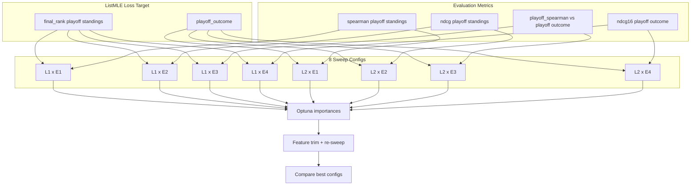

# Metric-Matrix Exploration Plan

**Project:** NBA True Strength Prediction  
**Purpose:** Systematically explore sweeps by Spearman/NDCG and playoff standings/playoff outcome. Track promising hyperparameters, use Optuna importances for feature trimming, and identify the best configuration.

---

## 1. Matrix: Loss Target × Evaluation Metric

| Loss Target (ListMLE)             | Eval Metric                | Sweep Objective    | Notes                                            |
| --------------------------------- | -------------------------- | ------------------ | ------------------------------------------------ |
| final_rank (playoff standings)    | Spearman playoff standings | spearman_standings | Requires eval vs EOS_playoff_standings           |
| final_rank (playoff standings)    | NDCG playoff standings     | ndcg_standings     | Requires eval vs EOS_playoff_standings           |
| final_rank (playoff standings)    | Spearman playoff outcome   | playoff_spearman   | Already supported                                |
| final_rank (playoff standings)    | NDCG playoff outcome       | ndcg16             | Eval uses EOS_global_rank=playoff when available |
| playoff_outcome (playoff outcome) | Spearman playoff standings | spearman_standings | Requires eval vs EOS_playoff_standings           |
| playoff_outcome (playoff outcome) | NDCG playoff standings     | ndcg_standings     | Requires eval vs EOS_playoff_standings           |
| playoff_outcome (playoff outcome) | Spearman playoff outcome   | playoff_spearman   | Already supported                                |
| playoff_outcome (playoff outcome) | NDCG playoff outcome       | ndcg16             | Already supported (phase4)                       |

**Terminology:**
- **Playoff standings** = EOS_playoff_standings = final regular-season rank (1–30 by reg-season win%).
- **Playoff outcome** = eos_final_rank / post_playoff_rank = playoff result (champion=1, runner-up=2, …).

**Eval extension:** Add explicit `spearman_standings` and `ndcg_at_16_standings` in `scripts/5_evaluate.py` and `src/evaluation/` using `EOS_playoff_standings` as y_true, so playoff standings vs playoff outcome metrics are clearly separated.

### Results (outputs5): outcome vs standings

We compared **listmle_target: playoff_outcome** vs **final_rank** (standings), evaluated on playoff outcome. **Finding:** Training ListMLE on **standings** matched or beat **outcome** for predicting playoff result. Best: ndcg_standing (Spearman 0.529, playoff Spearman 0.531, rank MAE 6.47). See `outputs5/ndcg_outcome`, `outputs5/ndcg_standing`, `outputs5/spearman_outcome`, `outputs5/spearman_standing` and **outputs/ANALYSIS.md** §3b.

---

## 2. Sweep Objectives to Add

In `scripts/sweep_hparams.py`:

- Add `spearman_standings` and `ndcg_standings` to `_OBJECTIVE_KEYS` (map to new eval keys).
- Ensure `playoff_spearman` and `ndcg16` remain supported.

---

## 3. Promising Hyperparameters (Non-Best) Tracking

See `outputs4/sweeps/PROMISING_COMBOS.md` for configs that were strong but not best. Use Optuna importances from each sweep (lr, n_xgb, n_rf, epochs) for feature-trimming context.

---

## 4. 8 Sweeps (2 loss targets × 4 objectives)

For each of `final_rank` (playoff standings) and `playoff_outcome` (playoff outcome):

1. **spearman_standings** — optimize Spearman vs playoff standings (EOS_playoff_standings).
2. **ndcg_standings** — optimize NDCG@16 vs playoff standings.
3. **playoff_spearman** — optimize Spearman vs playoff outcome.
4. **ndcg16** — optimize NDCG@16 vs playoff outcome (already done for both targets).

Phase: `phase2_fine` or `phase2_playoff_broad`; 25–35 trials each.

---

## 5. Optuna Importances for Feature Trimming

- After each sweep, read `optuna_importances.json`.
- Aggregate importances across sweeps; identify consistently low-importance params.
- Use Model B SHAP from `scripts/5b_explain.py` to identify low-importance input features.
- Add a feature-trimming experiment: drop lowest-SHAP features, re-sweep, compare.

---

## 6. Final Comparison

- Build a summary table: best combo per (loss_target, objective).
- Compare all 8 configs on a common holdout using: spearman_standings, ndcg_standings, playoff_spearman, ndcg16.
- Select production config as the one that best matches the chosen primary metric (e.g., NDCG playoff outcome or playoff_spearman).

---

## Data Flow

---

## Execution Order (Phase 2)

1. Extend eval + sweep for `spearman_standings` and `ndcg_standings`.
2. Run 8-sweep matrix (2 loss targets × 4 objectives).
3. Compare best configs; select production default.
