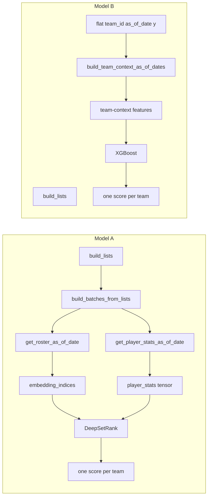

# Model A vs Model B: Input, Training, Output, and Performance

Comparison of Model A (DeepSet + ListMLE) and Model B (XGB): how they process input, train, produce predictions, why they differ, strengths/weaknesses, and performance across configs. See [BEST_METRICS.md](BEST_METRICS.md) for detailed run tables and config notes.

---

## 1. Input processing

| Aspect | Model A (DeepSetRank) | Model B (XGBoost) |
|--------|------------------------|-------------------|
| **Granularity** | **Player-level**: each team = set of up to 15 players (roster) with per-player stats | **Team-level**: one row per (team_id, as_of_date) with aggregated team features |
| **Input construction** | `build_batches_from_lists` (src/training/data_model_a.py): for each list (conference + date), for each team: roster via `get_roster_as_of_date`, then `get_player_stats_as_of_date` (rolling L10/L30), on-court PM, continuity; `build_roster_set` produces embedding indices, stat matrix, minutes, mask | `build_lists` yields (team_id, as_of_date, win_rates); `build_team_context_as_of_dates` (src/features/team_context.py) merges Four Factors, pace, and optional ELO, Massey, rolling, motivation, injury per config |
| **Feature set** | Player embeddings + rolling stats (PLAYER_STAT_COLS_L10_L30, on-off), minutes, roster order; config: rolling_windows, roster_size | Base: eFG, TOV_pct, FT_rate, ORB_pct, pace; extended by config: elo, massey_rating, eFG_L10, DefRtg_L10, won_prev_game, motivation/injury (`get_team_context_feature_cols`) |
| **Data flow** | Batches = (embedding_indices, player_stats, minutes, key_padding_mask) per list; one forward pass per list → one score per team | Flat table merged with team-context features; one row per (team, date) → one prediction per row |

**Summary:** Model A sees who is on the court and how they’re playing (player set); Model B sees team-level box-score and optional context (no player identities).

---

## 2. Training

| Aspect | Model A | Model B |
|--------|---------|---------|
| **Objective** | **ListMLE**: maximize probability of observed ranking within each (conference, date) list (listwise). | **Regression**: minimize squared error between predicted and target `y` (pointwise). |
| **Target `y`** | When `listmle_target=playoff_outcome`: relevance = 31 - playoff outcome rank. When `final_rank`: 31 - standings rank. Else: win_rates from build_lists. Stored in list_metas as `rel_values`. | **Always** from `lst["win_rates"]` in script 4 (scripts/4_train_models_b_and_c.py). Model B is trained on **standings-to-date win rate**, not playoff outcome rank. |
| **Training loop** | Walk-forward by season; OOF from validation; final model on all train seasons (script 3). | K-fold by **date** on train_dates from script 3; same dates as Model A for OOF alignment (script 4). |
| **Output** | One scalar score per team per list (higher = stronger). | One scalar prediction per (team, date) (same scale as y = win rate). |

**Critical difference:** When `listmle_target=playoff_outcome`, Model A is trained to rank by playoff finish; Model B is trained to predict standings win rate. That makes their outputs differ (playoff vs standings signal).

---

## 3. Inference / predictions

- **Model A**: For each (as_of_date, list of teams), build the same player-set batches, run DeepSetRank forward → one score per team. Scores are ranking scores (higher = better).
- **Model B**: For each (team_id, as_of_date), build team-context feature row (same as training), run XGB predict → one value per team (higher = better for stacking).
- **Stacking**: Ridge meta learns `ensemble_score = coef_[0]*score_A + coef_[1]*score_B + intercept` on OOF; at inference both scores are combined the same way (src/inference/predict.py, src/models/stacking.py).

---

## 4. What makes their answers different

1. **Different inputs**: Player-level set (A) vs team-level vector (B).
2. **Different training target when `listmle_target=playoff_outcome`**: A = playoff outcome rank; B = win rate (standings).
3. **Different objective**: Listwise ranking (A) vs pointwise regression (B).
4. **Different model class**: Neural set (attention over players) vs gradient-boosted trees (tabular).
5. **Config sensitivity**: A uses rolling_windows, attention (temperature, multi-temp), epochs; B uses XGB hyperparams and which team-context features are enabled.

---

## 5. Strengths and weaknesses

**Model A**

- **Strengths**: Uses roster and player-level play; can capture “who’s on the court” and lineup effects; listwise objective matches ranking evaluation; often stronger NDCG (e.g. 0.51–0.61 in outputs6). Stable across configs (Spearman ~0.45–0.49 in phase_1 outcome runs).
- **Weaknesses**: Needs player-game data and roster construction; more compute; rank RMSE typically higher than B (e.g. 8.7–9.1 vs B’s 6.9–8.4 in same runs).

**Model B**

- **Strengths**: Simple tabular features; fast; often better Spearman and lower rank RMSE (e.g. Spearman 0.53–0.68, RMSE 6.88–8.41 in outputs6 phase_1). Good for “predict standings-like strength” because it’s trained on win rate.
- **Weaknesses**: No player identity; no explicit set structure; when eval is vs playoff outcome, it’s indirectly learning via correlation with win rate. NDCG often lower than A (e.g. 0.37–0.42 vs A’s 0.51–0.61). More sensitive to XGB hyperparameters across combos.

**Ensemble (after stacking fix)**

- Combines both; in outputs6 phase_1 (post-fix) ensemble Spearman (0.67–0.75) and rank accuracy (MAE 5.2–5.8, RMSE 6.1–7.0) beat both A and B alone.

---

## 6. Performance across scenarios and configs

Summary from BEST_METRICS.md and outputs6:

- **WSL sweep (playoff_outcome)**: Model A Spearman ~0.53, NDCG up to 0.61; Model B Spearman up to 0.68, NDCG ~0.41–0.42. Best Spearman combo (18): A 0.53, B 0.62; best NDCG combo (10): A NDCG 0.82, B 0.68 Spearman.
- **outputs4 local (pre–stacking fix)**: Ensemble broken (negative Spearman); A and B both healthy (A ρ 0.46–0.47, NDCG 0.60–0.61; B ρ 0.62–0.68, RMSE 6.88–7.51).
- **outputs6 phase_1 outcome (post–stacking fix)**: Ensemble ρ 0.67–0.75, MAE 5.2–5.8, RMSE 6.1–7.0; A ρ 0.45–0.49, NDCG 0.51–0.61; B ρ 0.53–0.68, RMSE 6.88–8.41. best_ndcg30 / best_rmse give strongest B (ρ 0.68, RMSE 6.88); best_spearman gives best A NDCG (0.61).
- **Config differences**: Phase 6 vs WSL differ mainly in Model B (XGB) params and Model A attention (temperature, multi-temp). Model B tends to gain more from “best NDCG” configs in Spearman and RMSE; Model A keeps more stable NDCG across configs.

For run-by-run tables and config side-by-sides, see [BEST_METRICS.md](BEST_METRICS.md).

---

## 7. East vs West comparison

Metrics can be computed **per conference** (East = E, West = W) so we can compare how well the models rank teams within each conference.

**Where to find it:** In each run folder, `eval_report.json` (and `eval_report_<season>.json`) contains **`test_metrics_by_conference`** with keys `"E"` and `"W"`. Each conference has:

- **ndcg**, **spearman** — Within-conference ranking quality (relevance = derived from EOS global rank: best team in conference = rank 1, etc.).
- **rank_mae_ensemble_pred_vs_playoff_outcome_rank**, **rank_rmse_ensemble_pred_vs_playoff_outcome_rank** — Ensemble rank error vs playoff outcome within that conference.
- Same **rank_mae** / **rank_rmse** for **model_a**, **xgb**, **rf** and for **wl_record_standings** (baseline).

**Interpretation:**

- **Model A** is trained on conference-date lists, so it naturally produces a ranking within each conference; East and West are independent lists. Differences in E vs W NDCG/Spearman can reflect roster depth, style of play, or strength spread in that conference.
- **Model B** is trained on a flat team-level table; E/W is only an evaluation split. Better West than East (or vice versa) can indicate that team-context features correlate more with outcome in one conference.
- **Ensemble** combines both; if East has higher Spearman than West (or lower rank MAE), the stack is doing better in that conference for that run.

**Caveat:** If relevance were **global** rank (1–30) and we computed Spearman *within* one conference only, we could get negative or misleading correlations because within a conference we only see a slice of global ranks. The pipeline avoids this by defining **within-conference relevance** for per-conference metrics (see `notes.per_conference_relevance` in `eval_report.json`). See also [CHECKPOINT_PROJECT_REPORT.md](CHECKPOINT_PROJECT_REPORT.md) §3.5 (per-conference caveat) and [ANALYSIS_OF_ATTENTION_WEIGHTS.md](ANALYSIS_OF_ATTENTION_WEIGHTS.md) §5 (conference-specific metrics).
